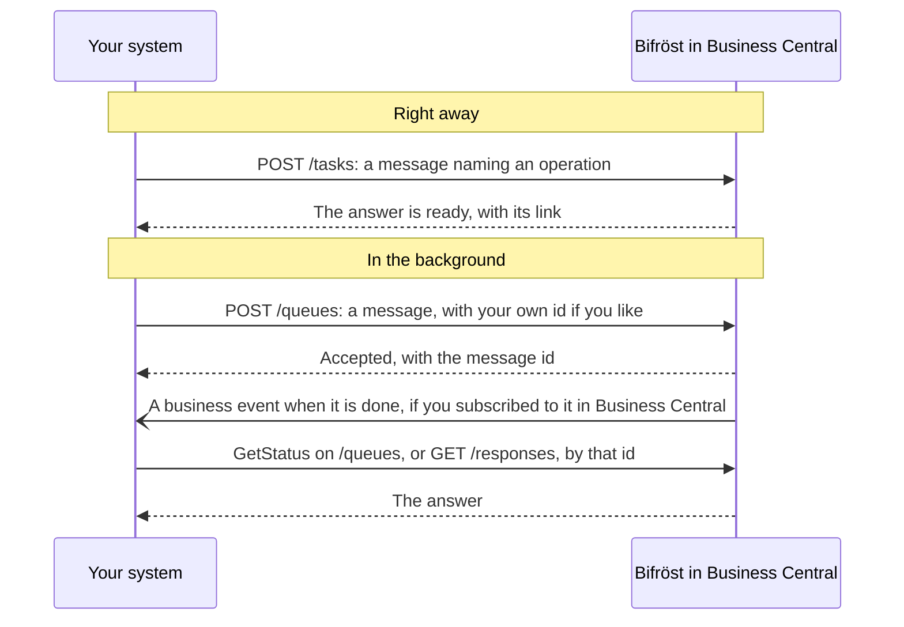

# Connecting to Bifröst: for developers

Everything an assistant can do through Bifröst, your own systems can do too, through the same
operations. This page takes you from an empty Entra tenant to a first call; the ideas are in
[How Bifröst works](/documentation/how-it-works/).

## Before you start

An administrator has to have run the setup wizard in each company you will call, in
[step 2 of Set it up](/setup/business-central/). Until it has run, Bifröst refuses calls for that company.

An integration does not need [step 3, Consent once](/setup/consent/), or the steps
[For each user](/setup/pick-your-assistant/): those are for AI assistants. It signs in with its own Entra application.

## Register your integration

Your system calls Bifröst as a **Microsoft Entra application**: an identity of its own, not a person. It signs in
with the OAuth client credentials flow, which Business Central calls service-to-service authentication.

1. **Register the application in Microsoft Entra ID.** Give it a client secret and the **Dynamics 365 Business
   Central** application permission for the APIs (full access; Microsoft's guide below names it), and grant admin consent. Microsoft describes each step in
   [Using service-to-service authentication](https://learn.microsoft.com/en-us/dynamics365/business-central/dev-itpro/administration/automation-apis-using-s2s-authentication).
   The token's scope is `https://api.businesscentral.dynamics.com/.default`.
2. **Add it in Business Central** on the **Microsoft Entra Applications** page: its client ID, a description, and
   **State** set to **Enabled**.
3. **Give it permissions** on the same card: `BIFROST API ori`, the Business Central permissions for the data it
   works with, and a posting gate for each ledger it posts to. An application cannot be given SUPER. Which sets:
   [Permission sets and gates](/documentation/end-customers/permissions/).

## Where the endpoints are

Bifröst's endpoints are Business Central API pages in the route `/api/origo/bifrost/v1.0/`:

| Endpoint | What it does | Reference |
|---|---|---|
| `tasks` | Runs a message at once; when the call returns, the answer is ready | [Bifrost Task API](/help/foundation/bifrost-task-api/) |
| `queues` | Accepts a message to run in the background and returns its id | [Bifrost Queue API](/help/foundation/bifrost-queue-api/) |
| `responses` | Reads the answer to a message, by its id | [Bifrost Response Data API](/help/foundation/bifrost-response-data-api/) |
| `requests` | Reads a message's request as it was sent | [Bifrost Request Data API](/help/foundation/bifrost-request-data-api/) |

You call them per company, like any Business Central API:

```text
https://api.businesscentral.dynamics.com/v2.0/{tenant}/{environment}/api/origo/bifrost/v1.0/companies({companyId})/tasks
```

The **Environment** group on [Bifrost Setup](/help/foundation/bifrost-setup/) shows the **Task API Url** and
**Queue API Url** of the company you are in.

A message names the operation, its *message type*, and carries the operation's input. The answer to `tasks` and
`queues` holds a link to the answer on `/responses`. Read it as the same identity that sent the message: each caller
sees only its own answers. `BIFROST API ori` is enough to read them.



- [INTEGRATING guide](https://github.com/businesscentralal/bc-bifrost-reference/blob/main/INTEGRATING.md):
  calling Bifröst from another system, worked end to end

## When a call fails

There are two kinds of failure.

- **Business Central refuses the request.** For example, the message type is unknown, or the identity has no
  permission for the endpoint. The HTTP call itself fails, with Business Central's usual error body. An unknown message type is
  answered with a pointer to `Help.MessageTypes.Get`.
- **The operation runs but cannot finish.** The answer then says so: `status` is `Error`, `error` says what went
  wrong in plain words, and most answers also carry a `code`. When one field of the input was wrong, `parameter`
  names it.

What to do: read the error, fix the request or the setup it names, and send a new message. For a message sent to
`/queues`, the **Bifrost Message Failed** event tells you it failed (see below), and the queue has three actions,
called on the message, for example `POST …/queues({id})/Microsoft.NAV.GetStatus`:

| Action | What it does |
|---|---|
| `GetStatus` | Says whether the message is still running or done |
| `RetryTask` | Runs the same message again, for example after the setup it needed has been fixed |
| `CancelTask` | Cancels a message that has not run yet |

## Get told when it is done

A message sent to `/queues` runs in the background. Instead of asking again and again, your system
can subscribe to two business events in Business Central, in the category **Origo Bifrost**:

| Event | Raised when |
|---|---|
| **Bifrost Message Completed** | A queued message has finished |
| **Bifrost Message Failed** | A queued message has failed |

Each notification carries the message id, the operation's name, a link to the answer and the time.
Read the answer from `/responses` with that link, as the identity that sent the message. A message sent to `/tasks`
raises no event, because the answer is ready when the call returns.

You subscribe the same way as to any Business Central business event: with the business events
API, which posts to a URL you give, or with a Power Automate flow. See Microsoft's
[Business events on Business Central](https://learn.microsoft.com/en-us/dynamics365/business-central/dev-itpro/developer/business-events-overview).
The subscribing identity needs the **Ext. Events – Subscr** permission set and read permission on Bifröst's
messages, for example through `BIFROST Read ori`.

## Drive it from an AI agent

Connect an AI assistant through the Bifröst MCP server: see [Connect your assistant](/setup/connect-your-ai/).
The assistant reads the installed operations and their descriptions from Business Central itself.

## Find what an operation does

Operations are grouped into [domains](/documentation/how-it-works/#domains-and-operations), such as
Customer or Sales. The MCP server's tools use the same word (`list_domains`, `describe_domains`).

The catalogue is live: an agent or system asks Bifröst which operations exist
(`Help.MessageTypes.Get`) and reads each one's description and contract (`Help.Implementation.Get`).
That answer is always current for your environment. The same list is on the **Bifrost Message
Types** page in Business Central, and the MCP tools `describe_domains` and
`describe_message_type` read it too.

## What it counts

An integration's calls count in the **App Registration** pool, apart from people's calls. What
counts as a message: [Usage and limits](/documentation/end-customers/administrators/#usage-and-limits).
See also [Licensing](/licensing/).

**Next:** [Permission sets and gates](/documentation/end-customers/permissions/), for the sets your integration needs.
