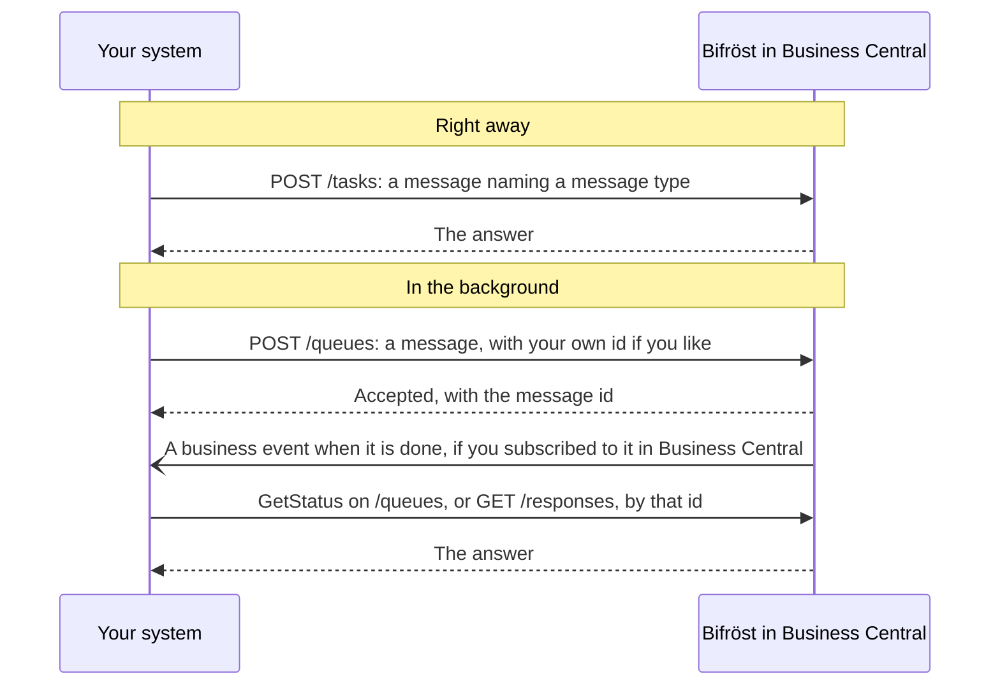

# Connecting to Bifröst: for developers

Everything an assistant can do through Bifröst, your own systems can do too, through the same
message types. This page points you to the right reference; the ideas are in
[How Bifröst works](/documentation/how-it-works/).

## Before you start

An administrator has to have done two things first, in [step 2 of Set it up](/setup/business-central/):

- **run the setup wizard** in each company you will call;
- **added your integration's Entra application** on the **Microsoft Entra Applications** page in
  Business Central, with the permission set `BIFROST API ori`, the Business Central permissions for
  its data, and a posting gate for each ledger it posts to.

Step 3, connecting an AI assistant, is not needed for an integration: it signs in with its own Entra
application.

## Connect another system

An integration calls Bifröst as a **Microsoft Entra application** with its own permissions in
Business Central (see [Step 2](/setup/business-central/#give-people-and-apps-permission)). It
sends a message naming a message type and reads the answer, or is told when it is done.

- [API reference](/foundation/reference/api/): endpoints, the message envelope and response shapes
- [Authentication](/skills/bifrost-bc-integration/references/authentication/): the base address,
  the token scope and the company segment
- [Errors](/foundation/reference/errors/): what an error answer contains
- [Events and webhooks](/foundation/reference/events-and-webhooks/): being told instead of polling
- [INTEGRATING guide](https://github.com/businesscentralal/bc-bifrost-reference/blob/main/INTEGRATING.md)
  in the partner reference repository: calling Bifröst from another system, worked end to end

## Drive it from an AI agent

[Skills for AI agents](/skills/) are what an agent loads before it works with Business Central
through Bifröst: the envelope, the rules and the mistakes to avoid.

## Find what a message type does

The catalogue is live: an agent or system asks Bifröst which message types exist
(`Help.MessageTypes.Get`) and reads each one's contract (`Help.Implementation.Get`). That answer is
always current for your environment.

For reading ahead, each app has a message type reference generated from the app itself, for example
[Foundation's](/foundation/reference/message-types/). Other apps: from the [app list](/apps/).
Two to start with:

- [Sales.Document.Create](/foundation/reference/message-types/sales-document-create/) creates a sales
  document header; its help says how to add the lines.
- [Item.Availability.Get](/foundation/reference/message-types/item-availability-get/) returns
  availability per location.

## What it counts

An integration's calls count in the **App Registration** pool, apart from people's calls. What
counts as a message: [Usage and limits](/documentation/end-customers/administrators/#usage-and-limits).
See also [Licensing](/foundation/licensing/).

## Add your own message types

Want your own operations in the catalogue? See [Build on Bifröst](/extensibility/).

**Next:** the [API reference](/foundation/reference/api/).
