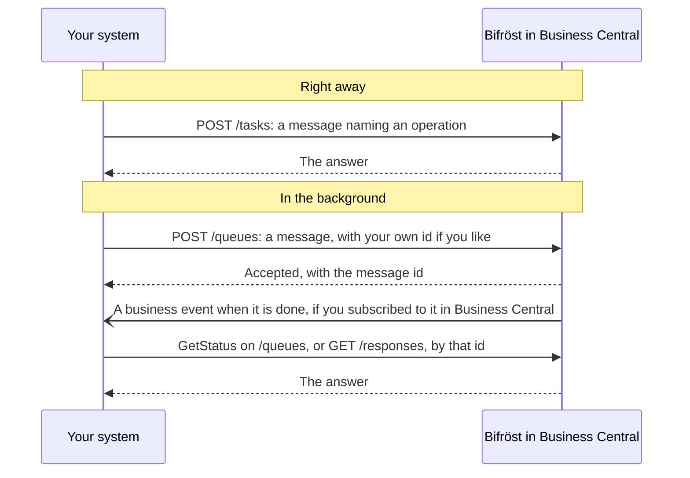

# Connecting to Bifröst: for developers

Everything an assistant can do through Bifröst, your own systems can do too, through the same
operations. This page points you to the right reference; the ideas are in
[How Bifröst works](/documentation/how-it-works/).

## Before you start

An administrator has to have done two things first, in [step 2 of Set it up](/setup/business-central/):

- **run the setup wizard** in each company you will call;
- **added your integration's Entra application** on the **Microsoft Entra Applications** page in
  Business Central, with the permission set `BIFROST API ori`, the Business Central permissions for
  its data, and a posting gate for each ledger it posts to.

Step 3, connecting an AI assistant, is not needed for an integration: it signs in with its own Entra
application.

## Connect another system

An integration calls Bifröst as a **Microsoft Entra application** with its own permissions in
Business Central (see [Step 2](/setup/business-central/#give-people-and-apps-permission)). It
sends a message that names the operation, its *message type*, and reads the answer, or is told
when it is done.

- [INTEGRATING guide](https://github.com/businesscentralal/bc-bifrost-reference/blob/main/INTEGRATING.md):
  calling Bifröst from another system, worked end to end

## Get told when it is done

A message sent to `/queues` runs in the background. Instead of asking again and again, your system
can subscribe to two business events in Business Central, in the category **Origo Bifrost**:

| Event | Raised when |
|---|---|
| **Bifrost Message Completed** | A queued message has finished |
| **Bifrost Message Failed** | A queued message has failed |

Each notification carries the message id, the operation's name, a link to the answer and the time.
Read the answer from `/responses` with that link, as the same identity that sent the message: each
caller sees only its own messages. A message sent to `/tasks` raises no event, because the answer
is ready when the call returns.

You subscribe the same way as to any Business Central business event: with the business events
API, which posts to a URL you give, or with a Power Automate flow. See Microsoft's
[Business events on Business Central](https://learn.microsoft.com/en-us/dynamics365/business-central/dev-itpro/developer/business-events-overview).
The subscribing identity needs the **Ext. Events – Subscr** permission set and read access to
Bifröst's messages.

## Drive it from an AI agent

Connect an AI assistant through the Origo BC MCP server: see [Connect your AI](/setup/connect-your-ai/).
The assistant reads the installed operations and their descriptions from Business Central itself.

## Find what an operation does

Operations are grouped into [domains](/documentation/how-it-works/#domains-and-operations), such as
Customer or Sales. The MCP server's tools use the same word (`list_domains`, `describe_domains`).

The catalogue is live: an agent or system asks Bifröst which operations exist
(`Help.MessageTypes.Get`) and reads each one's description and contract (`Help.Implementation.Get`).
That answer is always current for your environment. The same list is on the **Bifrost Message
Types** page in Business Central, and the MCP tools `list_message_types` and
`describe_message_type` read it too.

## What it counts

An integration's calls count in the **App Registration** pool, apart from people's calls. What
counts as a message: [Usage and limits](/documentation/end-customers/administrators/#usage-and-limits).
See also [Licensing](/licensing/).

**Next:** [Connect your AI](/setup/connect-your-ai/).
