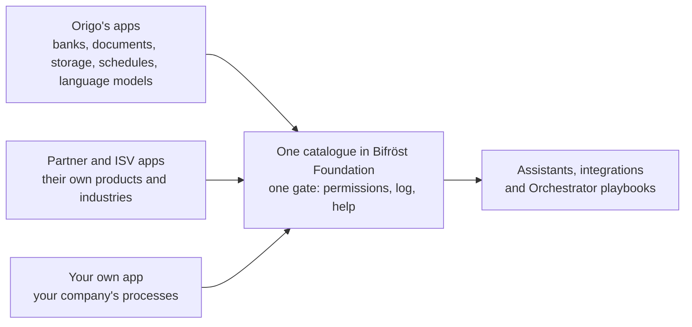

# How Bifröst works

**Ask Business Central. It works out how.**

Getting a new answer out of an ERP has always meant someone building it first: a report, an
integration, a project with a budget and a queue. Bifröst removes that step. You ask in your own
words, in Copilot, Claude or another AI assistant, and an **agent** does the work in Business
Central. (On this site, *agent* means the AI, or another system, acting for you.)

It can do that because the operations Bifröst offers are published as **message types**. Each
message type does one thing, such as checking item availability, turning a quote into an order or
posting a document, and each one describes itself: what it does, what it needs, what it returns and
what can go wrong. The agent reads those descriptions, picks the right operations and calls them.

## Three things that make it different

- **Nothing is built for your question.** The operations describe themselves, so an agent can
  combine them, including for questions nobody planned for.
- **It runs as you.** Every call runs as your own Business Central user, with your permissions, or
  as the app identity an integration was given. It reaches only what that identity is allowed to,
  and every call is logged in your Business Central. You decide what each identity may do; see
  [Administrators](/documentation/end-customers/administrators/).
- **It grows without a release.** Any app, Origo's or a partner's, can add message types, and every
  connected agent can use them the same day.

## How it fits together

import PlatformMap from '@site/src/components/PlatformMap';

<PlatformMap />

[Bifröst Foundation](/foundation/) is the one gate. It holds the catalogue of message types, hands
out their help, checks permissions and license, and logs every call. Everything else in the family
is an app that adds its own message types to the same catalogue. The [app list](/apps/) shows them.

## What happens when you ask

> "How many of item 1896-S can we still promise this week, and where are they?"

1. **The agent searches** the catalogue in your words and gets a short list of candidates.
2. **It chooses** by their one-line descriptions. `Item.Availability.Get` returns calculated
   availability per location, including reservations and expected receipts, which is what the
   question is about; the on-hand count alone would not answer it.
3. **It reads the help** of that message type: how to name the item, what comes back.
4. **It calls it.** Foundation checks that you may, runs it as you and logs the call.

   

5. **It answers** in plain words, with the figures per location.

A change works the same way, with one more safeguard: the agent can look before it acts.

> "Turn quote SQ-1042 into an order and show me what posting it would do."

The agent calls `Sales.Quote.MakeOrder`, then `Sales.Document.PreviewPost`, which shows the entries
posting would create **without posting anything**. You see the result before anything is posted,
and whether the agent may post at all is decided by the permissions of the identity it runs as.

When something goes wrong, the answer says what to do next, for example that a number does not
exist and how to look it up. The agent corrects itself or asks you.

## Where your data goes

import DataFlow from '@site/src/components/DataFlow';

<DataFlow />

In more detail:

- **Origo** does not store message contents or your business data, {/* OPEN-07 OPEN-08 OPEN-18 */} and they are not used to train
  AI models. Its licensing service keeps your Bifröst configuration (company identification,
  environment name and connection details), usage counts with times and message type names, and a
  hashed identifier of your tenant; the apps also send it technical diagnostics (telemetry). {/* OPEN-09 */} The
  setup wizard shows what the licensing service stores before you accept.
- **Bifrost Messages** in your Business Central keeps each call with the data it returned, for as
  long as you decide; see [Logs and retention](/documentation/end-customers/administrators/#logs-and-retention).

The full statement: [Privacy](/foundation/privacy/).

## How far it goes

| | What | Example |
|---|---|---|
| **Answer** | A question answered from live data | "What is still open on this project?" |
| **Act** | One operation, on request | "Release this sales order." |
| **Chain** | Several operations toward one outcome | Quotes to orders, previewed, reported back |
| **Keep** | A result you open again | A credit-exposure view you check each morning |
| **Run on a schedule** | The same chain, unattended | A reconciliation every Friday, with [Orchestrator](/orchestrator/) |
| **Build on it** | An assistant or app other people use | A role-specific console, or your own app's message types |

## What it covers, and how it grows

Installing Bifröst Foundation does not open all of Business Central to an assistant. It opens what
has been built for it, and that is a lot:

| | How far it reaches | How |
|---|---|---|
| **Read** | Most of your data | A general read reaches any table that is not restricted, within your permissions and [Field Access](/documentation/end-customers/administrators/#field-access). Most questions can be answered. |
| **Do** | What has a message type | Creating, converting, releasing and posting each need their own message type. Foundation brings them for sales, purchasing, finance, inventory, warehouse and projects, among others; the [catalogue](/foundation/reference/message-types/) lists them. Not every task in Business Central has one yet. |
| **Change a field** | A narrow, guarded path | A general write can change fields in a record, by default only the fields the change log covers ([ChangeLog Write Guard](/documentation/end-customers/administrators/#the-setup-page)). It does not replace an operation with Business Central's own logic. |

When there is no message type for a task, the assistant cannot do it through Bifröst, and it should
say so. {/* OPEN-19 */} That is the edge of what is installed, not a fault.

### Every app moves the edge

Message types come from apps, and anyone can build one. Each new message type joins the same
catalogue, behind the same gate: the same permissions, the same log, the same help an agent reads
before it calls. Every connected agent can use it the day the app is installed.

*In words: Origo's apps, partners' and ISVs' apps and your own apps all add message types to one
catalogue in Bifröst Foundation, and assistants, integrations and Orchestrator playbooks use them
all the same way.*

- **Origo's apps** add areas such as Icelandic banks, document exchange, storage and schedules;
  see the [app list](/apps/).
- **Partners and ISVs** add the operations of their own apps and industries, and list them in the
  [app registry](/apps/register-your-app/). See [Build on Bifröst](/extensibility/).
- **Your own developers** can add message types for your company's own processes, the same way.
- **[Orchestrator](/orchestrator/)** chains message types from any app into routines, with no code.

Missing something? Ask your partner or Origo: it may already exist in an app, or be something they
can build.

**Next:** [Set it up](/setup/), or the page for your role:
[Users](/documentation/end-customers/users/) · [Administrators](/documentation/end-customers/administrators/) ·
[Developers](/documentation/end-customers/developers/) · [Partners](/documentation/partners/).
