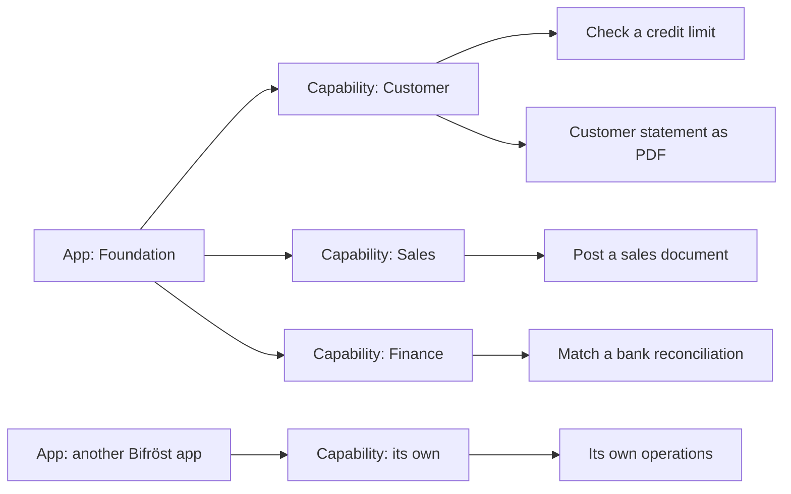

# How Bifröst works

**Ask Business Central. It works out how.**

Getting a new answer out of an ERP has always meant someone building it first: a report, an
integration, a project with a budget and a queue. Bifröst removes that step. You ask in your own
words, in Copilot, Claude or another AI assistant, and an **agent** does the work in Business
Central. (On this site, *agent* means the AI, or another system, acting for you.)

It can do that because the operations Bifröst offers are published as **message types**. Each
message type does one thing, such as checking item availability, turning a quote into an order or
posting a document, and each one describes itself: what it does, what it needs, what it returns and
what can go wrong. The agent reads those descriptions, picks the right operations and calls them.

## Capabilities and message types

Message types are grouped into **capabilities**. The first part of a message type's name says which
capability it belongs to. For example:

| Capability | A message type in it does |
|---|---|
| **Customer** | Checks a customer's credit: balance, overdue amount, open orders and what is left |
| **Sales** | Posts a sales document |
| **Item** | Works out how much of an item you can promise |

- **A message type** is one operation, and it is what an agent calls. Each one describes itself.

- **A capability** is a group of message types about the same thing, such as customers or sales
  documents. An agent looks at the capabilities first, then picks a message type inside the right
  one.
- **An app** is what you install. It adds one or more capabilities, or more message types to one
  that exists: Foundation brings the standard Business Central ones, and each other app adds its own.

*In words: an app adds capabilities, and each capability holds message types. Foundation adds
Customer, Sales and Finance, among others; another Bifröst app adds a capability of its own. Checking
a credit limit and printing a customer statement both belong to Customer.*

In the assistant's own tool list, capabilities are called *domains*. They have nothing to do with
Microsoft's **Copilot & agent capabilities** page in Business Central, which turns Copilot features on
and off.

Because every message type describes itself, a new one is usable as soon as its app is installed,
set up and permitted; nothing has to be taught to the assistant first.

## Four things that make it different

- **Nothing is built for your question.** The operations describe themselves, so an agent can
  combine them, including for questions nobody planned for.
- **It runs as you.** Every call runs as your own Business Central user, with your permissions, or
  as the app identity an integration was given. It reaches only what that identity is allowed to,
  and every call is logged in your Business Central. You decide what each identity may do; see
  [Administrators](/documentation/end-customers/administrators/).
- **It grows without a release.** Every Bifröst app you install adds capabilities, and every
  connected agent can use them the same day.
- **You choose the AI.** Copilot, ChatGPT, Claude or any other assistant that supports MCP works
  the same way, so you are not tied to one provider, and you can use more than one.

## How it fits together

import PlatformMap from '@site/src/components/PlatformMap';

<PlatformMap />

[Bifröst Foundation](/foundation/) is the one gate. It holds the catalogue of message types, hands
out their help, checks permissions and license, and logs every call. Everything else in the family
is an app that adds its own capabilities to the same catalogue. The [app list](/apps/) shows the
apps that are available.

## What happens when you ask

> "How many of item 1896-S can we still promise this week, and where are they?"

1. **The agent searches** the catalogue in your words and gets a short list of candidates.
2. **It chooses** by their one-line descriptions. The availability operation returns calculated
   availability per location, including reservations and expected receipts, which is what the
   question is about; the on-hand count alone would not answer it.
3. **It reads the help** of that message type: how to name the item, what comes back.
4. **It calls it.** Foundation checks that you may, runs it as you and logs the call.
5. **It answers** in plain words, with the figures per location.

A change works the same way, with one more safeguard: the agent can look before it acts.

> "Turn quote SQ-1042 into an order and show me what posting it would do."

The agent turns the quote into an order, then previews the posting, which shows the entries
posting would create **without posting anything**. You see the result before anything is posted,
and whether the agent may post at all is decided by the permissions of the identity it runs as.

When something goes wrong, the answer says what to do next, for example that a number does not
exist and how to look it up. The agent corrects itself or asks you.

## Where your data goes

import DataFlow from '@site/src/components/DataFlow';

<DataFlow />

In more detail:

- **Origo** does not store message contents or your business data, and they are not used to train
  AI models. Its licensing service keeps your Bifröst configuration (company identification,
  environment name and connection details), usage counts with times and message type names, and a
  hashed identifier of your tenant; the apps also send it technical diagnostics (telemetry). The
  setup wizard shows what the licensing service stores before you accept.
- **Bifrost Messages** in your Business Central keeps each call with the data it returned, for as
  long as you decide; see [Logs and retention](/documentation/end-customers/administrators/#logs-and-retention).

The full statement: [Privacy](/licensing/privacy/).

## How far it goes

From one answer to a chain of operations: [Try it out](/try-it-out/#what-to-ask-first)
goes through the levels, with a question to try for each.

## What it covers, and how it grows

Installing Bifröst Foundation does not open all of Business Central to an assistant. It opens what
has been built for it, and that is a lot:

| | How far it reaches | How |
|---|---|---|
| **Read** | Most of your data | A general read reaches any table that is not restricted, within your permissions and [Field Access](/documentation/end-customers/data-access/#field-access). Most questions can be answered. |
| **Do** | What has a message type | Creating, converting, releasing and posting each need their own message type. Foundation's capabilities cover sales, purchasing, finance, inventory and projects, among others. Not every task in Business Central has one yet. |
| **Change a field** | A narrow, guarded path | A general write can change fields in a record, by default only the fields the change log covers ([ChangeLog Write Guard](/documentation/end-customers/data-access/#the-changelog-write-guard)). It does not replace an operation with Business Central's own logic. |

When there is no message type for a task, the assistant cannot do it through Bifröst, and it should
say so. That is the edge of what is installed, not a fault.

### Every app moves the edge

Capabilities come from apps, and they all join the same catalogue, behind the same permissions and
the same log. Other Bifröst apps add capabilities of their own. Each has its own setup page, reached
from the **Apps** group on Bifröst Setup, its own help, and keeps its credentials in the shared secret
store; see the [app list](/apps/).

The assistant combines capabilities from different apps in one conversation.

**Missing something?**

1. Ask the assistant: *"Which capabilities can you use here?"* It lists what your installation has.
2. Look in the [app list](/apps/): it may be in an app you have not installed yet.
3. If not, ask your Business Central partner or [Origo](https://www.origo.is/). It can be built,
   either as a new app or as more message types in an app that exists.

**Next:** [Set it up](/setup/), or the page for your role:
[Users](/documentation/end-customers/users/) · [Administrators](/documentation/end-customers/administrators/) ·
[Developers](/documentation/end-customers/developers/).
