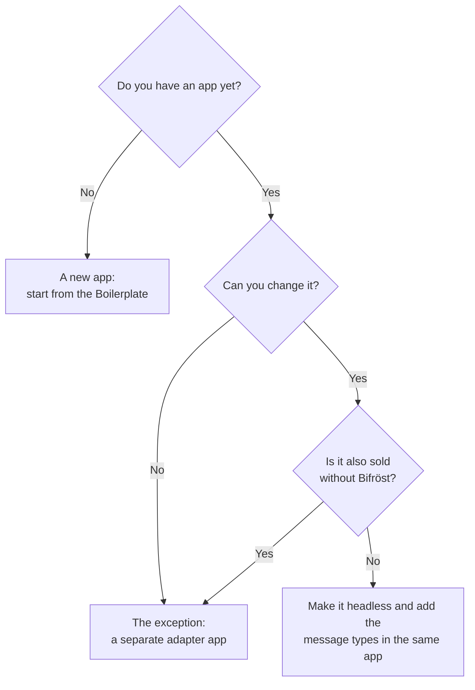

# Build on Bifröst

This chapter explains the ideas. The details, the rules and the code live in the
**[partner reference repository](https://github.com/businesscentralal/bc-bifrost-reference)**,
which is the source of truth for building on Bifröst. Its
[START-HERE guide](https://github.com/businesscentralal/bc-bifrost-reference/blob/main/START-HERE.md)
is written so that you can hand it to your coding agent (Claude Code, GitHub Copilot, Cursor and
the like) and build from it. The samples are MIT licensed, so you can copy them into your own apps.

## Message types are your app's public API

A **message type** is one operation your app offers, such as "log maintenance on a fixed asset"
or "list stock reservations". It has a name, a one-line description, a help document, and code
that does the work. Once it exists, every kind of caller can use it the same way: AI agents,
MCP hosts, integrations over the API, other AL code, and workflows in
[Bifrost Orchestrator](/orchestrator/).

Give your app's message types a **capability** of their own, usually one: the first part of their names, such as
`Calibration` for a calibration app. An agent looks at the capabilities first, so pick one
that is yours alone, never one another app already uses (`Sales`, `Data`, `Help` …).
[What a capability is](/documentation/how-it-works/#capabilities-and-message-types)

A plain AL procedure reaches only code that compiles against your app. A message type also gives
you, from the platform:

- **Reach**: agents, integrations and workflows find it and call it, with no code per caller.
- **Audit**: every call is logged: who called, what was sent, what came back.
- **Operations**: queueing, retries, completion events, versions and the caller's language.
- **One permission gate**: your permission set decides who can call it, for every caller alike.
- **A listing people and agents can search**, where the help is the documentation.
- **Usage** counted per message, which Origo or you as the partner can sell.

The principle behind all of it: **headless inside, message types outside.** Inside, your
business logic is a core that never talks to a person. Outside, callers use your message types,
not your procedures. [Why message types](https://github.com/businesscentralal/bc-bifrost-reference/blob/main/START-HERE.md#why-message-types)

import HeadlessMap from '@site/src/components/HeadlessMap';

<HeadlessMap />

## How an agent uses your message type

An agent that has never seen your app goes through four steps. At each it reads one part of your
contract: the *selection card* (the one-line description) or the *use card* (the help).

import AgentCards from '@site/src/components/AgentCards';

<AgentCards />

Almost everything that makes a good message type follows from these four steps. A name in the
user's words gets found. A description that says what it changes and how it differs from its
neighbours gets chosen. Help that is complete gets the first call right. An error that says what
to do next lets the agent correct itself.

## What a message type says about itself

Every message type carries its own description, in three layers. The agent reads them in this order
before it calls anything:

| Layer | What it says | For the customer credit check |
|---|---|---|
| **The name** | The capability, the thing and what is done to it | Customer · credit limit · get (reads, changes nothing) |
| **One line** | What it does, so the agent can choose between similar ones | Checks a customer's credit: balance, overdue amount, open orders and what is left |
| **The help** | What it needs, what it returns and what can go wrong | Which customer and how to name it; the figures that come back; the answer when the customer does not exist |

The help is written by the people who build the app and is read from Business Central itself: the
MCP tools `list_message_types` and `describe_message_type`, or the Bifrost Message Types page. So a
new message type is usable as soon as its app is installed, set up and permitted.

## Make it headless first

Every action on a page does two things: it **talks to a person** (a confirmation, a dialog, the
row they selected) and it **does the work** (checks rules, writes data). A caller without a screen
needs only the work, and cannot click OK. An app is **headless** when the work lives in procedures
that never talk to a person.

A good headless app:

- **Asks nothing during the work.** A choice a person would make becomes a parameter with a
  documented default.
- **Leaves transactions to the platform.** No commits of its own; writes are isolated, so a
  failure leaves nothing half done.
- **Keeps its rules in one core.** The pages and the message types both call the same core, so a
  rule cannot be skipped by calling from outside.
- **Makes hidden context explicit.** The work date, the selected record or the current user become
  parameters rather than assumptions.
- **Behaves the same with or without a screen.** A screen may change what is shown, never what is
  checked or done.

If you already have an app, start with an audit: the reference repository lists the patterns to
look for and shows a before-and-after pair of the same app.
[The idea, with a worked example](https://github.com/businesscentralal/bc-bifrost-reference/blob/main/Legacy%20App%20v2%20(headless)/README.md) ·
[The rules for headless code](https://github.com/businesscentralal/bc-bifrost-reference/blob/main/START-HERE.md#headless)

## Write the contract before the code

Everything a caller ever sees comes from the contract: the name, the description, the help, the
input checks and the error texts. Write it first and review it with the people who will use it.

The contract has **two cards for two moments**:

- **The selection card** is the one-line description. It is read among many others, so it must say
  what the type does in the user's words, what it changes (read-only or commits), and how it differs
  from its closest neighbour. Short and plain wins: longer descriptions make agents hesitate.
- **The use card** is the help. It is the only schema the caller gets, so it covers the whole
  contract every time: how to name the target, the parameters and formats, a runnable example, the
  response, every error with its exact text, whether a repeat call is safe, and the permissions
  needed. It describes what the caller sends and gets, never how it is built.

For example, a description like this gets picked for "log three hours on the forklift" and not for
posting costs:

> Log maintenance work on a fixed asset (machine, vehicle): date, hours and a short note. Commits;
> safe to retry with the same externalId. Not for FA ledger entries, depreciation or posting
> maintenance costs.

[The contract, with the template and a worked example](https://github.com/businesscentralal/bc-bifrost-reference/blob/main/START-HERE.md#two-moments-two-cards) ·
[How to check a contract](https://github.com/businesscentralal/bc-bifrost-reference/blob/main/START-HERE.md#checking-a-contract)

## What makes a good message type

Beyond the text, a good message type:

- **Keeps its promise.** The verb says what happens, and a read never writes.
- **Checks its input in one place**, and tells missing, not found, wrong type and wrong format apart.
- **Fails loudly and helpfully.** Every failure is an error with a next step; there is no silent
  success.
- **Lets the caller look before it acts.** A bulk or irreversible change comes as a preview and an
  apply, and the apply only goes ahead if nothing changed since the preview.
- **Is safe to call twice**, or says in its help what a repeat does.
- **Shows itself only to those who may use it**, and handles secrets so they never reach a log.
- **Joins the platform** instead of building its own: registers with Bifröst, uses its setup and
  secret store, and leaves setup notifications to Bifröst.

[The rules, each from a real failure in agent testing](https://github.com/businesscentralal/bc-bifrost-reference/blob/main/START-HERE.md) ·
[Where business rules live](https://github.com/businesscentralal/bc-bifrost-reference/blob/main/START-HERE.md#where-business-rules-live)

## Pick your path

In short: a new app starts from the Boilerplate in the reference repository. An app you own and
can change gets its message types in the same app. Only an app you cannot change, or one also sold
without Bifröst, gets a separate adapter app, which calls the app through its public procedures
(a facade).

The rule of thumb: the logic stays headless in the app that owns it, and a message type never
copies a business rule. The reference repository maps common partner situations, such as ISV
apps, customisations, connectors, batch jobs and apps on the older Cloud Events platform, to a path.
[Typical partner situations](https://github.com/businesscentralal/bc-bifrost-reference/blob/main/START-HERE.md#typical-partner-situations-and-which-path-fits)

## Test it the way a caller uses it

Test through Bifröst, the way an agent or integration calls, not by calling your code directly.
Beyond the happy path, try the calls that break things in real use: a missing or unknown target, a
wrong type, a local date format, a value out of range, the same call twice, and a call in another
language. Then check that the help still matches what the calls return. A type is done when its
contract, its headless audit, its help and these tests all agree.
[Testing](https://github.com/businesscentralal/bc-bifrost-reference/blob/main/TESTING.md)

## Beyond your own app

- **Calling message types**, from another system or from AL:
  [Integrating](https://github.com/businesscentralal/bc-bifrost-reference/blob/main/INTEGRATING.md).
  The endpoints themselves are in the [API reference](/foundation/reference/api/).
- **Chaining them into workflows.** A message type that follows the contract can be a step in a
  Bifrost Orchestrator playbook as it is.
  [What makes a good playbook step](https://github.com/businesscentralal/bc-bifrost-reference/blob/main/Bifrost%20Reference%20Playbooks/README.md)
- **Letting a coding agent do the work.** The repository ships agent skills: one for building
  message types, one for building playbooks by conversation.
  [Skills](https://github.com/businesscentralal/bc-bifrost-reference/tree/main/skills)

## Start

1. Read [the reference repository's README](https://github.com/businesscentralal/bc-bifrost-reference#readme)
   and run its quick start in your own sandbox.
2. Give [START-HERE](https://github.com/businesscentralal/bc-bifrost-reference/blob/main/START-HERE.md)
   to your coding agent and say which path you are on.
3. When your app is live, [register it](/apps/register-your-app/) so customers can find it.

## Foundation reference

What Foundation itself offers a dependent app, beyond the pattern above:

- [Foundation public surface](/extensibility/public-surface): the interfaces, enums and events you may rely on
- [Metering](/extensibility/metering): how usage of your message types is counted
- [Setup, secrets and the request log](/extensibility/setup-and-secrets)
- [Language Models extension points](/language-models/extensibility): adding a language-model provider
