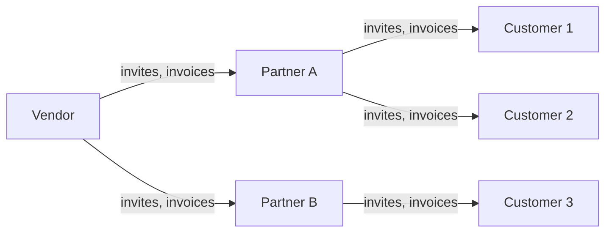
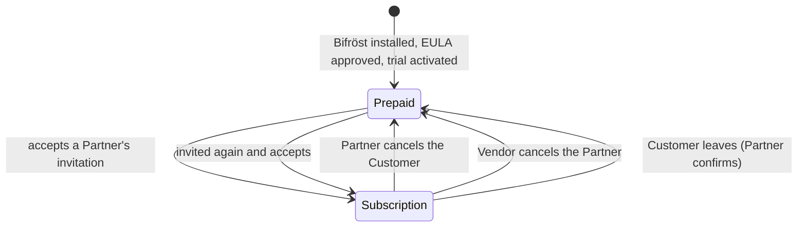

Every Bifröst call that does real work is counted as a **message**. How a tenant pays for those
messages depends on its **license type**, and the license type depends on whether the tenant is
served by a Bifröst **Partner**.

## Two license types

| | **Prepaid** | **Subscription** |
|---|---|---|
| Who | Every tenant when Bifröst Foundation is installed, and every tenant without a Partner | A tenant that has accepted an invitation from a Bifröst Partner (a *Customer*) |
| How you pay | You buy message quota up front and use it until it runs out | Your Partner invoices you every month for the messages you used |
| Limits | The purchased quota, per [pool](./license-types.md#two-pools), and optional **monthly quotas** you set yourself | Optional company and user **monthly quotas** you set yourself - there is no purchased quota |
| Rate limit | Free tier, 1,000 calls per day - cannot be changed | Free tier by default; you can choose a higher tier, which your Partner can charge for |
| Trial | 1,000 User + 1,000 App Registration messages, once per tenant | Not needed - the trial was used while the tenant was on Prepaid |

A new installation always starts on **Prepaid**: the administrator approves the licence agreement
(EULA) and activates the trial in the [Setup Wizard](/help/foundation/bifrost-setup-wizard/). A
tenant only becomes a Subscription customer later, when a Partner invites it and it accepts.

See [License types](./license-types.md) for the full rules, including sandboxes and on-premises
installations.

## Three roles

| Role | What it does | Where |
|---|---|---|
| **Vendor** | Brings Bifröst to market through its Partners. Invites Partners, sees every Partner's customers and usage, and **invoices its Partners** for the Subscription usage of their customers. | [Working as a Vendor](./vendor.md) |
| **Partner** | Serves Business Central customers. Invites customers to the Subscription license, sees their usage and rate-limit tier, and **invoices its customers**. | [Working as a Partner](./partner.md) |
| **Customer** | A tenant that accepted a Partner's invitation and is on the Subscription license. It can set monthly quotas, choose a rate-limit tier, and leave its Partner. | [Being a Customer](./customer.md) |

The roles are not offered for sign-up: Vendors are approved by Origo, Partners are invited by a
Vendor, and Customers are invited by a Partner. A Vendor can also register as its own Partner and
serve customers directly.

Each role is held by **one company per Microsoft Entra tenant** - the company that registered
first. The license type, on the other hand, applies to the **whole tenant**: when a tenant accepts
an invitation, all of its companies move to Subscription, including companies created later.

## How a tenant moves between license types

Every change that one tenant makes for another - an invitation, a cancellation, a leave request -
reaches the other tenant the next time it runs **Sync** on the Bifröst Setup page (Sync also runs
once a day in the background). See [Leaving and cancelling](./leaving-and-cancelling.md).

## In this section

- [License types](./license-types.md) - Prepaid, Subscription, sandbox and on-premises in detail
- [Rate limits](./rate-limits.md) - the tiers and who can change them
- [Working as a Vendor](./vendor.md)
- [Working as a Partner](./partner.md)
- [Being a Customer](./customer.md)
- [Leaving and cancelling](./leaving-and-cancelling.md)
- [Usage and billing](./usage-and-billing.md) - reports, message types and invoicing
- [Licensing reference](/foundation/reference/licensing/) - the contract callers see: pools, warnings and errors
