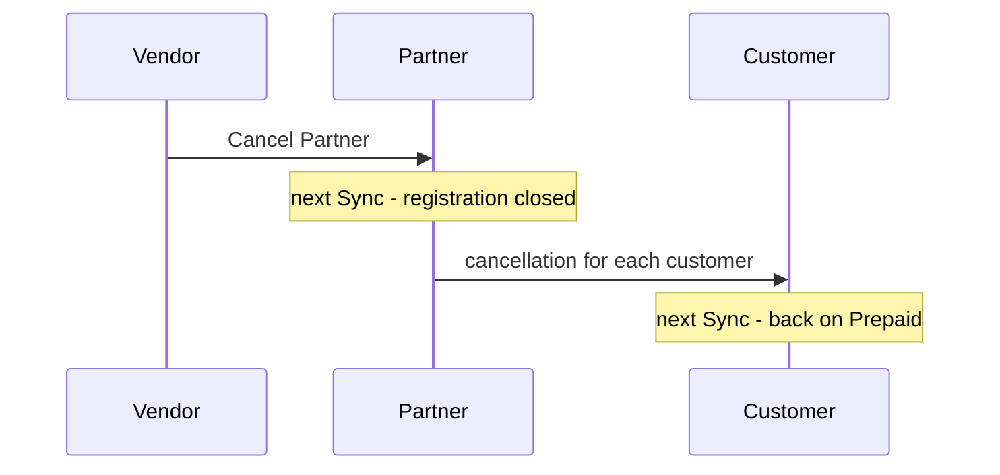

A relationship can be ended from the top (a Vendor cancels a Partner, a Partner cancels a Customer)
or asked for from below (a Customer or a Partner sends a leave request). In every case the
customers concerned return to the **Prepaid** license.

## Overview

| What happens | Started by | Result |
|---|---|---|
| **Cancel Customer** | Partner, on [Customer Management](/help/foundation/customer-management/) | The Customer returns to Prepaid. |
| **Request to Leave Partner** | Customer, on Bifröst Setup | The Partner confirms or rejects. Confirmed: as Cancel Customer. |
| **Cancel Partner** | Vendor, on [Partner Management](/help/foundation/partner-management/) | The Partner registration is closed; **every customer of that Partner** returns to Prepaid. |
| **Request to Leave Vendor** | Partner, on Bifröst Setup | The Vendor confirms or rejects. Confirmed: as Cancel Partner. |
| **Deregister as Vendor** | Vendor, on Bifröst Setup | **Every Partner** of the Vendor is cancelled, and every customer of those Partners returns to Prepaid. |

A cancellation can carry a reason (entered in the [Cancel - Reason](/help/foundation/cancel-reason/)
dialog), and a rejected leave request always does; the other tenant sees it on Bifröst Setup.

## When it takes effect

Each tenant applies what concerns it the next time a licence administrator chooses **Sync** on its
Bifröst Setup page. The daily background task only reports usage; it never applies a cancellation
or a leave-request outcome:

So a Vendor's cancellation reaches the customers after two syncs: the Partner's and then each
customer's.

## What the Customer sees

After the Sync that applies the cancellation, Bifröst Setup shows *Your Bifröst Partner relationship
has ended and the cancellation was applied on Sync. This tenant is back on the Prepaid license*.
From then on:

- calls use the tenant's purchased message quota again (see [License types](./license-types.md#prepaid));
- the rate limit is back to the Free tier - a tier chosen on Subscription is removed;
- **Request to Leave Partner** and **Configure Rate Limit** disappear from Bifröst Setup.

A rejected leave request shows as *Your leave request was rejected by Partner … : reason*, and
nothing changes.

## What the Partner and the Vendor keep

A cancelled customer disappears from Customer Management, but its **Subscription usage up to the
cancellation** stays in the billing figures of the period it happened in, so the Partner can
invoice it and the Vendor can invoice the Partner. See [Usage and billing](./usage-and-billing.md).

## Coming back

A former Customer can be invited again - by the same Partner or another - and accepting the
invitation moves the tenant back to Subscription. A former Partner can be invited again by a
Vendor.
