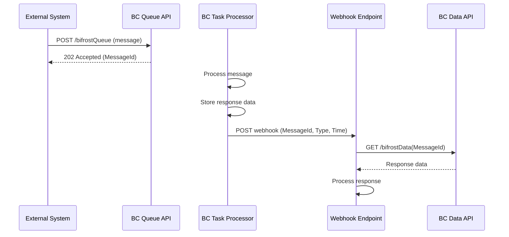
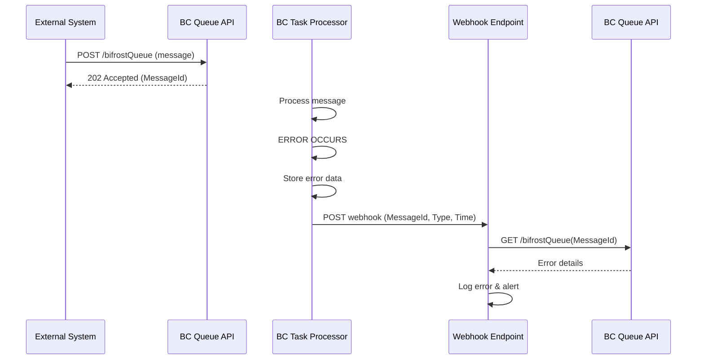

**Parent Document:** [API_Reference.md](/foundation/reference/api/)  
**Implementation Folder:** `app/src/Task/`  
**Codeunit:** `Message Events ori` (Codeunit 10078250)

---

## Overview

The Bifrost extension provides native Business Central **External Business Events** that enable external systems to receive webhook notifications when bifrost messages complete or fail. This allows for event-driven architectures where external systems are notified immediately rather than polling for status.

**Key Features:**

- **Minimal Notification Payloads**: Webhooks send only essential data (MessageId, MessageType, Timestamp)
- **Native BC Integration**: Uses Business Central's standard External Business Events framework
- **Automatic Retry**: Built-in retry logic for failed webhook deliveries
- **Event Subscriptions**: Configure subscriptions via Business Central's Event Subscriptions page
- **Secure Architecture**: External systems fetch full response data via authenticated API calls after receiving notifications

---

## Event Architecture

### External Business Events

Business Central's External Business Events allow external systems to subscribe to events and receive HTTP POST notifications when events occur. The Bifrost extension exposes two external business events:

1. **BifrostMessageCompleted**: Raised when a message processes successfully
2. **BifrostMessageFailed**: Raised when a message processing fails

### Event Category

All Bifrost webhook notifications are categorized under:
- **Category Name**: "Origo Bifrost"
- **EventCategory Extension**: Enum Extension 10077886 `Category ori`

This category can be used to filter and organize event subscriptions in Business Central.

### Minimal Payload Pattern

Webhook notifications intentionally send **minimal data** to:
- **Improve Security**: Response data may contain sensitive business information
- **Reduce Bandwidth**: Large response payloads would increase network costs
- **Maintain Flexibility**: Subscribers can fetch detailed data when ready
- **Support Retry**: Smaller payloads are more reliable for webhook retry mechanisms

After receiving a webhook notification, subscribers call the **Bifrost Data API** using the MessageId to retrieve the full response.

---

## Event: BifrostMessageCompleted

**Purpose:** Notifies external systems when a bifrost message has completed processing successfully.

**Event Name:** `BifrostMessageCompleted`  
**Event Display Name:** `Bifrost Message Completed`  
**Event Category:** `Origo Bifrost`  
**Raised By:** Codeunit 10078251 `Message Task ori`

### When This Event is Raised

The event is raised **after** a bifrost message has been successfully processed:

1. Message is submitted to Queue API or Task API
2. Message processing begins (via background task or synchronously)
3. Implementation executes business logic successfully
4. Response data is stored in `Message ori` table
5. **Event is raised** with MessageId, MessageType, and completion timestamp
6. Webhook notification is sent to all subscribers
7. Subscribers receive notification and can fetch response data

### Webhook Payload

```json
{
  "MessageId": "a8f5f167-8f2c-4a42-9b3e-5c6c7d8e9f0a",
  "MessageType": "Customer.CreditLimit.Get",
  "ResponseContentLink": "/api/origo/bifrost/v1.0/responses(a8f5f167-8f2c-4a42-9b3e-5c6c7d8e9f0a)/data",
  "Timestamp": "2026-03-08T14:30:22Z"
}
```

### Payload Fields

| Field | Type | Description |
|-------|------|-------------|
| `MessageId` | Guid | Unique identifier for the message. Use this to call GET /bifrostData(MessageId) to retrieve full response. |
| `MessageType` | Text[250] | The type of message that completed (e.g., "Customer.CreditLimit.Get", "Data.Records.Get"). Can be used for routing or filtering. |
| `ResponseContentLink` | Text[250] | Direct API link to download response data. Use this URL to retrieve the full response without constructing the API path manually. |
| `Timestamp` | DateTime | When the message completed processing (ISO 8601 format). |

### Retrieving Full Response Data

After receiving the webhook notification, call the Bifrost Data API to retrieve the full response:

**Request:**
```http
GET /api/origo/bifrost/v1.0/responses('{message-id}')
Authorization: Bearer {token}
```

**Response:**
```json
{
  "id": "a8f5f167-8f2c-4a42-9b3e-5c6c7d8e9f0a",
  "data": "... full response data as base64 or JSON ..."
}
```

### Example Integration Flow



### Use Cases

- **Asynchronous Processing**: External systems are notified immediately when long-running operations complete
- **Event-Driven Architecture**: Trigger workflows in external systems based on BC message completion
- **Real-Time Integration**: Minimize latency between BC processing and external system reaction
- **Decoupled Systems**: External systems don't need to poll BC for status updates

---

## Event: BifrostMessageFailed

**Purpose:** Notifies external systems when a bifrost message processing has failed.

**Event Name:** `BifrostMessageFailed`  
**Event Display Name:** `Bifrost Message Failed`  
**Event Category:** `Origo Bifrost`  
**Raised By:** Codeunit 10078249 `Message Error ori`

### When This Event is Raised

The event is raised **after** a bifrost message processing has failed:

1. Message is submitted to Queue API or Task API
2. Message processing begins (via background task or synchronously)
3. Implementation encounters an error or validation fails
4. Error details are captured and stored in `Message ori` table
5. **Event is raised** with MessageId, MessageType, and failure timestamp
6. Webhook notification is sent to all subscribers
7. Subscribers receive notification and can fetch error details

### Webhook Payload

```json
{
  "MessageId": "b9f6f267-9f3d-5b52-0c4f-6d7d8e9f1b1b",
  "MessageType": "Data.Records.Set",
  "ResponseContentLink": "/api/origo/bifrost/v1.0/responses(b9f6f267-9f3d-5b52-0c4f-6d7d8e9f1b1b)/data",
  "Timestamp": "2026-03-08T14:35:18Z"
}
```

### Payload Fields

| Field | Type | Description |
|-------|------|-------------|
| `MessageId` | Guid | Unique identifier for the message. Use this to call GET /bifrostQueue(MessageId) to retrieve error details. |
| `MessageType` | Text[250] | The type of message that failed (e.g., "Data.Records.Set", "Sales.Document.Release"). |
| `ResponseContentLink` | Text[250] | Direct API link to download error details. Use this URL to retrieve the error response without constructing the API path manually. |
| `Timestamp` | DateTime | When the message failed processing (ISO 8601 format). |

### Retrieving Error Details

After receiving the webhook notification, call the Queue API ori to retrieve error details:

**Request:**
```http
GET /api/origo/bifrost/v1.0/queues('{message-id}')
Authorization: Bearer {token}
```

**Response:**
```json
{
  "id": "b9f6f267-9f3d-5b52-0c4f-6d7d8e9f1b1b",
  "type": "Data.Records.Set",
  "specversion": "1.0",
  "source": "MyIntegrationApp v1.0",
  "time": "2026-03-08T14:35:15Z",
  "datacontenttype": "text/json",
  "data": "{
    \"error\": \"Record not found\",
    \"detailedMessage\": \"Table: Customer, SystemId: {guid}\",
    \"stackTrace\": \"...\",
    \"callStack\": \"...\"
  }"
}
```

### Error Response Format

Error responses are stored in JSON format with the following fields:

- **error**: Short error message
- **detailedMessage**: Detailed error description
- **stackTrace**: Full stack trace (if available)
- **callStack**: Call stack at time of error (if available)

### Example Integration Flow



### Use Cases

- **Error Monitoring**: External systems can log and alert on failures immediately
- **Automatic Retry**: External systems can implement retry logic with exponential backoff
- **Error Analysis**: Fetch detailed error information for troubleshooting
- **SLA Tracking**: Monitor processing failures and response times

---

## Integration Events

In addition to External Business Events for webhooks, the Bifrost extension provides **Integration Events** that allow other Business Central extensions to react to message lifecycle events.

### OnBeforeBifrostMessageProcessing

**Purpose:** Raised before a bifrost message starts processing.

**Event Type:** IntegrationEvent  
**Visibility:** Internal  
**Raised By:** Codeunit 10078251 `Message Task ori`

**Signature:**
```al
[IntegrationEvent(false, false)]
internal procedure OnBeforeBifrostMessageProcessing(var BifrostMessage: Record "Message ori")
```

**Parameters:**
- `BifrostMessage`: The message record about to be processed (passed by reference, can be modified)

**Use Cases:**
- **Pre-Processing Validation**: Validate message data before processing begins
- **Data Enrichment**: Add additional context or metadata to the message
- **Telemetry**: Log message processing start event
- **Custom Routing**: Modify message type or data based on custom logic

### OnAfterBifrostMessageCompleted

**Purpose:** Raised after a bifrost message completes successfully.

**Event Type:** IntegrationEvent  
**Visibility:** Internal  
**Raised By:** Codeunit 10078251 `Message Task ori`

**Signature:**
```al
[IntegrationEvent(false, false)]
internal procedure OnAfterBifrostMessageCompleted(var BifrostMessage: Record "Message ori")
```

**Parameters:**
- `BifrostMessage`: The completed message record (passed by reference)

**Use Cases:**
- **Post-Processing**: Perform additional actions after successful processing
- **Data Synchronization**: Sync message data to other tables or systems
- **Telemetry**: Log completion metrics (duration, size, etc.)
- **Workflow Triggering**: Start dependent workflows or processes

### OnAfterBifrostMessageFailed

**Purpose:** Raised after a bifrost message processing fails.

**Event Type:** IntegrationEvent  
**Visibility:** Internal  
**Raised By:** Codeunit 10078249 `Message Error ori`

**Signature:**
```al
[IntegrationEvent(false, false)]
internal procedure OnAfterBifrostMessageFailed(var BifrostMessage: Record "Message ori"; ErrorText: Text)
```

**Parameters:**
- `BifrostMessage`: The failed message record (passed by reference)
- `ErrorText`: The error message text

**Use Cases:**
- **Error Logging**: Log errors to custom logging tables
- **Alert Generation**: Send alerts via email or other channels
- **Automatic Recovery**: Attempt automatic recovery or data correction
- **Analytics**: Track error patterns and failure rates

---

## Setting Up Webhook Subscriptions

### Prerequisites

1. **External Webhook Endpoint**: You need an HTTPS endpoint that can receive POST requests
2. **Endpoint Requirements**:
   - Must support HTTPS (not HTTP)
   - Must respond with 2xx status code within timeout period (default 30 seconds)
   - Should handle duplicate notifications (idempotency)
   - Should implement exponential backoff for retries

### Configuration Steps

#### Step 1: Navigate to Event Subscriptions

1. Open Business Central web client
2. Search for **"Event Subscriptions"**
3. Open the Event Subscriptions page

#### Step 2: Create New Subscription

1. Click **New**
2. Fill in the following fields:

| Field | Value | Description |
|-------|-------|-------------|
| **Subscriber ID** | (Auto-generated) | Unique identifier for the subscription |
| **Event Name** | `BifrostMessageCompleted` or `BifrostMessageFailed` | Choose which event to subscribe to |
| **Company Name** | Your company name | Company context for the event |
| **Event Category** | `Origo Bifrost` | Filter to Bifrost category |
| **Endpoint URL** | `https://your-domain.com/webhook/bc-bifrost` | Your webhook endpoint URL |
| **Authentication** | (Select method) | How to authenticate to your endpoint |

#### Step 3: Configure Authentication

Choose authentication method:

**Option 1: OAuth 2.0 (Recommended)**
- **Grant Type**: Client Credentials
- **Authorization URL**: Your OAuth provider URL
- **Client ID**: Your OAuth client ID
- **Client Secret**: Your OAuth client secret
- **Token URL**: Your OAuth token endpoint

**Option 2: Basic Authentication**
- **Username**: Your basic auth username
- **Password**: Your basic auth password

**Option 3: API Key**
- **API Key Name**: Header name (e.g., "X-API-Key")
- **API Key Value**: Your API key

**Option 4: None**
- No authentication (not recommended for production)

#### Step 4: Test Subscription

1. Use the **"Test Subscription"** action to send a test event
2. Verify your endpoint receives the test payload
3. Check the **"Last Delivery Status"** field for success/failure

#### Step 5: Activate Subscription

1. Set **"Enabled"** field to **Yes**
2. The subscription is now active and will receive events

### Webhook Endpoint Best Practices

#### 1. Idempotency {#idempotency}

Your endpoint should handle duplicate notifications gracefully:

```javascript
// Example: Node.js Express endpoint
app.post('/webhook/bc-bifrost', async (req, res) => {
  const { MessageId, MessageType, ResponseContentLink, Timestamp } = req.body;
  
  // Check if we've already processed this message
  const exists = await db.checkMessageProcessed(MessageId);
  if (exists) {
    console.log(`Duplicate notification for ${MessageId}, ignoring`);
    return res.status(200).send('OK'); // Still return 200 to prevent retries
  }
  
  // Mark as processed before fetching data
  await db.markMessageProcessing(MessageId);
  
  // Fetch full response data from BC using the provided link
  const response = await fetchBifrostData(ResponseContentLink);
  
  // Process the response
  await processResponse(response, MessageType);
  
  // Mark as completed
  await db.markMessageCompleted(MessageId);
  
  res.status(200).send('OK');
});
```

#### 2. Asynchronous Processing {#asynchronous-processing}

Respond to webhook quickly and process data asynchronously:

```javascript
app.post('/webhook/bc-bifrost', async (req, res) => {
  const { MessageId, MessageType, ResponseContentLink, Timestamp } = req.body;
  
  // Immediately queue for background processing
  await queue.enqueue({
    messageId: MessageId,
    messageType: MessageType,
    responseContentLink: ResponseContentLink,
    timestamp: Timestamp
  });
  
  // Respond immediately
  res.status(200).send('OK');
});

// Background worker processes the queue
backgroundWorker.on('job', async (job) => {
  const response = await fetchBifrostData(job.responseContentLink);
  await processResponse(response, job.messageType);
});
```

#### 3. Error Handling {#error-handling}

Implement proper error handling and logging:

```javascript
app.post('/webhook/bc-bifrost', async (req, res) => {
  try {
    const { MessageId, MessageType, ResponseContentLink, Timestamp } = req.body;
    
    // Validate payload
    if (!MessageId || !MessageType || !ResponseContentLink || !Timestamp) {
      console.error('Invalid payload received', req.body);
      return res.status(400).send('Invalid payload');
    }
    
    // Queue for processing
    await queue.enqueue({
      messageId: MessageId,
      messageType: MessageType,
      responseContentLink: ResponseContentLink,
      timestamp: Timestamp
    });
    
    res.status(200).send('OK');
  } catch (error) {
    console.error('Webhook processing error:', error);
    // Return 4xx for client errors (don't retry)
    // Return 5xx for server errors (BC will retry)
    res.status(500).send('Internal Server Error');
  }
});
```

#### 4. Retry Handling {#retry-handling}

Handle retries with exponential backoff when fetching data from BC:

```javascript
async function fetchBifrostData(messageId, maxRetries = 3) {
  for (let attempt = 1; attempt <= maxRetries; attempt++) {
    try {
      const response = await bcApi.get(`/bifrostData(${messageId})`);
      return response.data;
    } catch (error) {
      if (attempt === maxRetries) throw error;
      
      // Exponential backoff: 1s, 2s, 4s
      const delay = Math.pow(2, attempt - 1) * 1000;
      await sleep(delay);
    }
  }
}
```

#### 5. Monitoring and Alerting {#monitoring-and-alerting}

Implement monitoring for webhook delivery failures:

```javascript
app.post('/webhook/bc-bifrost', async (req, res) => {
  const startTime = Date.now();
  
  try {
    const { MessageId, MessageType, Timestamp } = req.body;
    
    await queue.enqueue({
      messageId: MessageId,
      messageType: MessageType,
      timestamp: Timestamp
    });
    
    // Track success metrics
    metrics.webhookReceived(MessageType);
    metrics.webhookLatency(Date.now() - startTime);
    
    res.status(200).send('OK');
  } catch (error) {
    // Track failure metrics
    metrics.webhookFailed(error);
    
    // Alert on critical failures
    if (shouldAlert(error)) {
      alerting.sendAlert('Webhook processing failure', error);
    }
    
    res.status(500).send('Internal Server Error');
  }
});
```

---

## Testing Webhooks

### Test Message Submission

Submit a test message to trigger webhook notifications:

```bash
# Submit test message to Queue API
curl -X POST "https://your-bc-instance/api/origo/bifrost/v1.0/queues" \
  -H "Authorization: Bearer YOUR_TOKEN" \
  -H "Content-Type: application/json" \
  -d '{
    "specversion": "1.0",
    "type": "Help.Tables.Get",
    "source": "Webhook Test v1.0"
  }'
```

### Monitor Event Delivery

1. Open **Event Subscriptions** page in Business Central
2. Find your subscription
3. Check the following fields:
   - **Last Delivery Status**: Success/Failed
   - **Last Delivery Attempt**: Timestamp of last delivery
   - **Last Delivery Error**: Error message if delivery failed

### Troubleshooting

#### Webhook Not Receiving Events

1. **Check Subscription Status**: Ensure subscription is **Enabled**
2. **Verify Event Name**: Confirm you're subscribed to correct event (`BifrostMessageCompleted` or `BifrostMessageFailed`)
3. **Check Endpoint URL**: Verify URL is correct and accessible
4. **Test Connectivity**: Use "Test Subscription" action in Event Subscriptions
5. **Review Firewall Rules**: Ensure BC can reach your endpoint
6. **Check Authentication**: Verify credentials are correct

#### Delivery Failures

1. **Check Endpoint Response Time**: Must respond within timeout (default 30s)
2. **Verify HTTPS**: Endpoint must use HTTPS, not HTTP
3. **Check Status Code**: Endpoint must return 2xx status code
4. **Review Error Logs**: Check "Last Delivery Error" field in Event Subscriptions
5. **Test Manually**: Call your endpoint directly with sample payload

#### Duplicate Notifications

Business Central may send duplicate notifications in certain scenarios:
- Network timeouts (BC didn't receive response in time)
- Retry failures (endpoint returned 5xx error)
- System restarts during delivery

**Solution**: Implement idempotency in your webhook endpoint (see Best Practices above)

---

## Security Considerations

### 1. Authentication {#authentication}

**Always use authentication** for webhook endpoints:
- **OAuth 2.0**: Recommended for production environments
- **API Keys**: Good for simpler scenarios
- **Basic Auth**: Acceptable but less secure
- **None**: Only for development/testing

### 2. HTTPS Only {#https-only}

Business Central enforces HTTPS for webhook endpoints. HTTP endpoints are not supported for security reasons.

### 3. Data Privacy {#data-privacy}

Webhook notifications contain minimal data (MessageId, MessageType, Timestamp) to:
- **Protect sensitive data**: Full response data may contain customer/financial information
- **Comply with GDPR**: Minimize personal data in transit
- **Reduce exposure**: Smaller payloads reduce risk if webhook is compromised

Always fetch full data via authenticated API calls after receiving webhook notification.

### 4. Endpoint Security {#endpoint-security}

Protect your webhook endpoint:
- **Validate payload**: Check that payload structure matches expected format
- **Rate limiting**: Prevent abuse by implementing rate limits
- **IP whitelisting**: Restrict to known Business Central IP ranges (if applicable)
- **Request signing**: Consider implementing request signature verification

### 5. Error Information {#error-information}

Error details (stackTrace, callStack) in failed message responses may contain:
- Code structure information
- Variable values
- System paths

**Recommendation**: Restrict access to error details to authorized personnel only.

---

## Performance Considerations

### 1. Webhook Response Time {#webhook-response-time}

Respond to webhooks within **30 seconds** (default timeout):
- Acknowledge receipt immediately (return 200 OK)
- Queue data fetching and processing for background workers
- Don't fetch response data from BC before acknowledging webhook

### 2. Data Fetching {#data-fetching}

When fetching response data after webhook notification:
- Implement retry logic with exponential backoff
- Cache responses to avoid repeated API calls
- Use compression if fetching large responses
- Implement pagination for large result sets

### 3. Message Volume {#message-volume}

For high-volume scenarios:
- Use message queuing (e.g., Azure Service Bus, RabbitMQ, AWS SQS)
- Scale webhook endpoint horizontally
- Implement batch processing for efficiency
- Monitor queue depth and processing latency

### 4. Monitoring {#monitoring}

Track key metrics:
- **Webhook delivery success rate**: How many webhooks are delivered successfully
- **Webhook latency**: Time to respond to webhook
- **Data fetch latency**: Time to fetch data from BC after notification
- **Processing latency**: Time to process fetched data
- **Error rate**: Percentage of failed messages

---

## Code Reference

### External Business Events

**Codeunit:** 10078250 `Message Events ori`

```al
/// Raised when a bifrost message processing completes successfully
[ExternalBusinessEvent('BifrostMessageCompleted', 'Bifrost Message Completed', 
  'A bifrost message has completed successfully.', EventCategory::"Origo Bifrost")]
procedure OnBifrostMessageCompleted(MessageId: Guid; MessageType: Text[250]; Timestamp: DateTime)

/// Raised when a bifrost message processing fails
[ExternalBusinessEvent('BifrostMessageFailed', 'Bifrost Message Failed', 
  'A bifrost message has failed processing.', EventCategory::"Origo Bifrost")]
procedure OnBifrostMessageFailed(MessageId: Guid; MessageType: Text[250]; Timestamp: DateTime)
```

### Integration Events

```al
/// Raised before a bifrost message starts processing
[IntegrationEvent(false, false)]
internal procedure OnBeforeBifrostMessageProcessing(var BifrostMessage: Record "Message ori")

/// Raised after a bifrost message completes successfully
[IntegrationEvent(false, false)]
internal procedure OnAfterBifrostMessageCompleted(var BifrostMessage: Record "Message ori")

/// Raised after a bifrost message processing fails
[IntegrationEvent(false, false)]
internal procedure OnAfterBifrostMessageFailed(var BifrostMessage: Record "Message ori"; ErrorText: Text)
```

### Event Category Extension

**EnumExtension:** 10077886 `Category ori`

```al
enumextension 10077886 "Category ori" extends EventCategory
{
    value(10077885; "Origo Bifrost")
    {
        Caption = 'Origo Bifrost';
    }
}
```

---

## Related Documentation

- **[API Reference](/foundation/reference/api/)**: Complete API endpoint documentation
- **[Data Message Types](/foundation/message-types/data/)**: Data integration message types
- **[Sales Message Types](/foundation/message-types/sales/)**: Sales and business operation message types
- **[Metadata Message Types](/foundation/message-types/metadata/)**: System metadata and discovery message types
- **[Setup Reference](/foundation/reference/setup/)**: Configuration and setup options

---

**© 2024 Origo. All rights reserved.**
