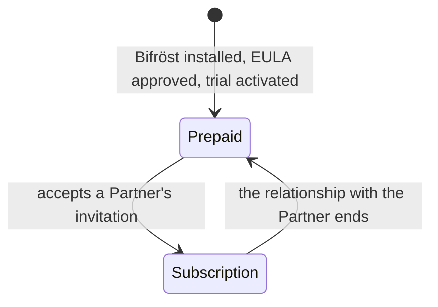

Every Bifröst call that does real work is counted as a **message**. How a tenant pays for those
messages depends on its **license type**, and the license type depends on whether the tenant is
served by a Bifröst **Partner**.

## Two license types

| | **Prepaid** | **Subscription** |
|---|---|---|
| Who | Every tenant when Bifröst Foundation is installed, and every tenant without a Partner | A tenant that has accepted an invitation from a Bifröst Partner (a *Customer*) |
| How you pay | You buy message quota up front and use it until it runs out | Your Partner invoices you every month for the messages you used |
| Limits | The purchased quota, per [pool](./license-types.md#two-pools), and optional **monthly quotas** you set yourself | Optional company and user **monthly quotas** you set yourself - there is no purchased quota |
| Rate limit | Production is not rate-limited. Sandbox usage on the public MCP server: Free tier, 1,000 messages per 24 hours - cannot be changed | Production is not rate-limited. Sandbox usage on the public MCP server: Free tier by default; you can choose a higher tier, which your Partner prices |
| Trial | 1,000 User + 1,000 App Registration messages, once per tenant | Not needed - the trial was used while the tenant was on Prepaid |

A new installation always starts on **Prepaid**: the administrator approves the licence agreement
(EULA) and activates the trial in the [Setup Wizard](/help/foundation/bifrost-setup-wizard/). A
tenant only becomes a Subscription customer later, when a Partner invites it and it accepts.

See [License types](./license-types.md) for the full rules, including sandboxes and on-premises
installations.

## How a tenant moves between license types

A tenant moves to the **Subscription** license when it accepts an invitation from a Bifröst
Partner, and returns to **Prepaid** when that relationship ends. The license type applies to the
**whole tenant**: when a tenant accepts an invitation, all of its companies move to Subscription,
including companies created later.

A change to the tenant's Partner relationship takes effect when a licence administrator chooses
**Sync** on the Bifrost Setup page.

## In this section

- [License types](./license-types.md) - Prepaid, Subscription, sandbox and on-premises in detail
- [Rate limits](./rate-limits.md) - the sandbox limit on the public MCP server, the tiers and how to raise it
- [Terms of Use](./eula.md) and [Privacy](./privacy.md)
- [Usage and billing](./usage-and-billing.md) - how your usage is reported and where you see it
