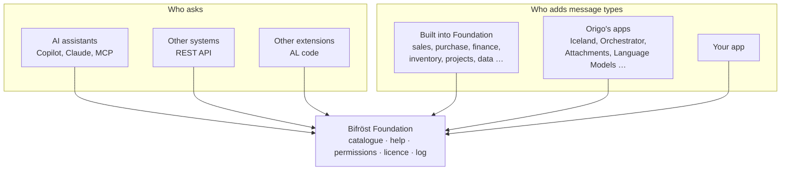

# What Bifröst is

**Ask Business Central. It works out how.**

Getting a new answer out of an ERP has always meant someone building it first: a report, an
integration, a project with a budget and a queue. Bifröst removes that step. You ask in your own
words, in Copilot, Claude or another AI assistant, and an agent does the work in Business Central.

It can do that because Business Central's operations are published as **message types**. Each
message type does one thing, such as checking a customer's credit, turning a quote into an order or
posting a document, and each one describes itself: what it does, what it needs, what it returns and
what can go wrong. The agent reads those descriptions, picks the right operations and calls them.

## Three things that make it different

- **Nothing is built for your question.** The operations describe themselves, so an agent can
  combine them, including for questions nobody planned for.
- **It runs as you.** Every call runs as your own Business Central user, with your permissions, or
  as the app identity an integration was given. It can never reach further than that identity can.
- **It grows without a release.** Any app, Origo's or a partner's, can add message types, and every
  connected agent can use them the same day.

## How it fits together

[Bifröst Foundation](/foundation/) is the one gate. It holds the catalogue of message types, hands
out their help, checks permissions and licence, and logs every call. Everything else in the family
is an app that adds its own message types to the same catalogue. The [app registry](/apps/) lists
them.

## What happens when you ask

> "Which customers are close to their credit limit?"

1. **The agent searches** the catalogue in your words and gets a short list of candidates.
2. **It chooses** by their one-line descriptions. `Customer.CreditLimit.Get` returns balance,
   outstanding amounts and credit limit status, which is what the question is about.
3. **It reads the help** of that message type: how to name the customer, what comes back.
4. **It calls it.** Foundation checks that you may, runs it as you and logs the call.
5. **It answers** in plain words, with the customers and the figures behind them.

A change works the same way, with one more safeguard: the agent can look before it acts.

> "Turn quote SQ-1042 into an order and show me what posting it would do."

The agent calls `Sales.Quote.MakeOrder`, then `Sales.Document.PreviewPost`, which shows the entries
posting would create **without posting anything**. You see the result before anything is posted,
and whether the agent may post at all is decided by the permissions of the identity it runs as.

When something goes wrong, the answer says what to do next, for example that a number does not
exist and how to look it up. The agent corrects itself or asks you.

## Why it is safe to hand to an agent

- **It finds the operations.** The catalogue lists what exists; nothing is guessed.
- **It reads the contract.** Each message type's help says exactly what to send and what comes back.
- **It looks before it leaps.** Posting can be previewed first, and bulk changes come as a preview
  and an apply.
- **It corrects itself.** Errors name the cause and the fix.

And underneath all of it: every call runs as the Business Central user it acts for, under Business
Central's own permissions, and every call is logged.

## How far it goes

| | What | Example |
|---|---|---|
| **Answer** | A question answered from live data | "What is our exposure to this customer?" |
| **Act** | One operation, on request | "Release this sales order." |
| **Chain** | Several operations toward one outcome | Quotes to orders, previewed, reported back |
| **Keep** | A result you open again | A credit-exposure view you check each morning |
| **Run on a schedule** | The same chain, unattended | A reconciliation every Friday, with [Orchestrator](/orchestrator/) |
| **Build on it** | An assistant or app other people use | A role-specific console, or your own app's message types |

## Start where you are

| You want to … | Go to |
|---|---|
| Know what it costs and how licensing works | [Licensing](/foundation/licensing/) |
| Install and set it up | [Bifröst Setup wizard](/help/foundation/bifrost-setup-wizard/) |
| Know where the data goes | [Privacy](/foundation/privacy/) |
| Call it from another system | [API reference](/foundation/reference/api/) |
| Build your own message types | [Build on Bifröst](/extensibility/) |
| Drive it from an AI agent | [Skills for AI agents](/skills/) |
| See every message type an app adds | That app's reference, from the [app list](/apps/) |
