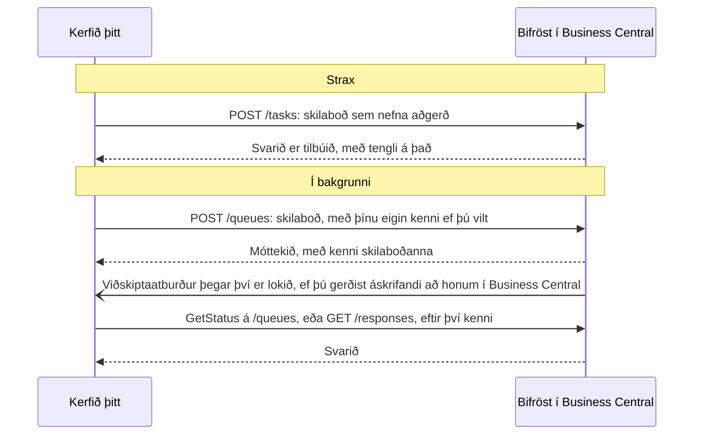

# Tenging við Bifröst: fyrir forritara

Allt sem aðstoðarmaður getur gert í gegnum Bifröst geta þín eigin kerfi gert líka, með sömu aðgerðum. Þessi síða fer
með þig frá tómum Entra-leigjanda að fyrsta kalli; hugmyndirnar eru í [Hvernig Bifröst virkar](/documentation/how-it-works/).

## Áður en þú byrjar {#before-you-start}

Kerfisstjóri þarf fyrst að hafa keyrt uppsetningarleiðsögnina í hverju fyrirtæki sem þú munt kalla í, í
[skrefi 2 í Settu það upp](/setup/business-central/). Þangað til hafnar Bifröst köllum fyrir það fyrirtæki.

Samþætting þarf hvorki [skref 3, Samþykktu einu sinni](/setup/consent/), né skrefin
[Fyrir hvern notanda](/setup/pick-your-assistant/): þau eru fyrir gervigreindaraðstoðarmenn. Hún skráir sig inn með eigin
Entra forriti.

## Skráðu samþættinguna {#register-your-integration}

Kerfið þitt kallar í Bifröst sem **Microsoft Entra forrit**: eigið auðkenni, ekki manneskja. Það skráir sig inn með
OAuth client credentials flæðinu, sem Business Central kallar þjónustu-til-þjónustu auðkenningu.

1. **Skráðu forritið í Microsoft Entra ID.** Gefðu því biðlaraleyndarmál og forritsheimildina fyrir API-in (fullur aðgangur; leiðbeiningar Microsoft hér að neðan nefna hana) á
   **Dynamics 365 Business Central**, og veittu stjórnandasamþykki. Microsoft lýsir hverju skrefi í
   [Using service-to-service authentication](https://learn.microsoft.com/en-us/dynamics365/business-central/dev-itpro/administration/automation-apis-using-s2s-authentication)
   (á ensku). Umfang (scope) tókans er `https://api.businesscentral.dynamics.com/.default`.
2. **Bættu því við í Business Central** á síðunni **Microsoft Entra forrit**: biðlarakenni þess og lýsingu, og gerðu
   það virkt (stöðureiturinn).
3. **Gefðu því heimildir** á sama spjaldi: `BIFROST API ori`, heimildir Business Central fyrir gögnin sem það vinnur
   með, og bókunarhlið fyrir hverja höfuðbók sem það bókar í. Forriti er ekki hægt að gefa SUPER. Hvaða samstæður:
   [Heimildasamstæður og hlið](/documentation/end-customers/permissions/).

## Hvar endapunktarnir eru {#where-the-endpoints-are}

Endapunktar Bifröst eru API-síður í Business Central, á leiðinni `/api/origo/bifrost/v1.0/`:

| Endapunktur | Hvað hann gerir | Tilvísun |
|---|---|---|
| `tasks` | Keyrir skilaboð strax; þegar kallinu lýkur er svarið tilbúið | [Bifrost Task API](/help/foundation/bifrost-task-api/) |
| `queues` | Tekur við skilaboðum til að keyra í bakgrunni og skilar kenni þeirra | [Bifrost Queue API](/help/foundation/bifrost-queue-api/) |
| `responses` | Les svarið við skilaboðum, eftir kenni þeirra | [Bifrost Response Data API](/help/foundation/bifrost-response-data-api/) |
| `requests` | Les beiðni skilaboða eins og hún var send | [Bifrost Request Data API](/help/foundation/bifrost-request-data-api/) |

Þú kallar í þá fyrir hvert fyrirtæki, eins og í hvaða Business Central API sem er:

```text
https://api.businesscentral.dynamics.com/v2.0/{tenant}/{environment}/api/origo/bifrost/v1.0/companies({companyId})/tasks
```

Flokkurinn **Umhverfi** á [Uppsetningu Bifröst](/help/foundation/bifrost-setup/) sýnir **Task API Url** og
**Queue API Url** fyrirtækisins sem þú ert í.

Skilaboð nefna aðgerðina, það er *skilaboðategund* hennar, og bera inntak aðgerðarinnar. Svar `tasks` og `queues`
geymir tengil á svarið á `/responses`. Lestu það sem sama auðkenni og sendi skilaboðin: hver sendandi sér aðeins sín
eigin svör. `BIFROST API ori` dugar til að lesa þau.



- [INTEGRATING leiðbeiningarnar](https://github.com/businesscentralal/bc-bifrost-reference/blob/main/INTEGRATING.md)
  (á ensku): köll í Bifröst úr öðru kerfi, frá upphafi til enda

## Þegar kall mistekst {#when-a-call-fails}

Kall getur mistekist á tvo vegu.

- **Business Central hafnar beiðninni.** Til dæmis er skilaboðategundin óþekkt, eða auðkennið hefur ekki heimild
  fyrir endapunktinum. HTTP-kallið sjálft mistekst þá, með venjulegu villusvari Business Central. Óþekktri
  skilaboðategund er svarað með ábendingu um `Help.MessageTypes.Get`.
- **Aðgerðin keyrir en getur ekki lokið sér af.** Svarið segir það þá: `status` er `Error`, `error` segir á mæltu máli
  hvað fór úrskeiðis, og flest svör bera líka `code`. Þegar einn reitur inntaksins var rangur nefnir `parameter` hann.

Hvað á að gera: lestu villuna, lagaðu beiðnina eða uppsetninguna sem hún nefnir, og sendu ný skilaboð. Fyrir skilaboð
sem send eru á `/queues` segir atburðurinn **Bifrost Message Failed** þér að þau mistókust (sjá hér að neðan), og
biðröðin hefur þrjár aðgerðir sem kallað er í á skilaboðunum, til dæmis `POST …/queues({id})/Microsoft.NAV.GetStatus`:

| Aðgerð | Hvað hún gerir |
|---|---|
| `GetStatus` | Segir hvort skilaboðin eru enn í keyrslu eða lokið |
| `RetryTask` | Keyrir sömu skilaboð aftur, til dæmis eftir að uppsetningin sem þau þurftu hefur verið löguð |
| `CancelTask` | Hættir við skilaboð sem hafa ekki keyrt enn |

## Fáðu að vita þegar því er lokið {#get-told-when-it-is-done}

Skilaboð sem send eru á `/queues` keyra í bakgrunni. Í stað þess að spyrja aftur og aftur getur kerfið þitt gerst
áskrifandi að tveimur viðskiptaatburðum í Business Central, í flokknum **Origo Bifrost**:

| Atburður | Þegar |
|---|---|
| **Bifrost Message Completed** | Skilaboðum í biðröð er lokið |
| **Bifrost Message Failed** | Skilaboð í biðröð mistókust |

Hver tilkynning ber kenni skilaboðanna, heiti aðgerðarinnar, tengil á svarið og tímann. Lestu svarið úr `/responses` með
þeim tengli, sem auðkennið sem sendi skilaboðin. Skilaboð sem send eru á `/tasks` vekja engan atburð, því svarið er
tilbúið þegar kallinu lýkur.

Þú gerist áskrifandi eins og að hverjum öðrum viðskiptaatburði í Business Central: með vefþjónustu viðskiptaatburða, sem
sendir á slóð sem þú gefur upp, eða með Power Automate flæði. Sjá
[Business events on Business Central](https://learn.microsoft.com/en-us/dynamics365/business-central/dev-itpro/developer/business-events-overview)
(á ensku) hjá Microsoft. Auðkennið sem gerist áskrifandi þarf heimildasamstæðuna **Ext. Events – Subscr** og
lesheimild á skilaboðum Bifröst, til dæmis með `BIFROST Read ori`.

## Stýrðu því frá gervigreindarfulltrúa {#drive-it-from-an-ai-agent}

Tengdu gervigreindaraðstoðarmann í gegnum Bifröst MCP-þjóninn: sjá [Tengdu aðstoðarmanninn](/setup/connect-your-ai/).
Aðstoðarmaðurinn les uppsettar aðgerðir og lýsingar þeirra úr Business Central sjálfu.

## Finndu hvað aðgerð gerir {#find-what-an-operation-does}

Aðgerðum er skipt í [lén](/documentation/how-it-works/#domains-and-operations), til dæmis Customer eða Sales. Verkfæri
MCP-þjónsins nota sama orð (`list_domains`, `describe_domains`).

Skráin er lifandi: fulltrúi eða kerfi spyr Bifröst hvaða aðgerðir eru til (`Help.MessageTypes.Get`) og les lýsingu og
samning hverrar þeirrar (`Help.Implementation.Get`). Það svar er alltaf rétt fyrir þitt umhverfi. Sami listi er á síðunni
**Bifrost Message Types** í Business Central, og MCP-verkfærin `list_message_types` og `describe_message_type` lesa hann
líka.

## Hvað það telur {#what-it-counts}

Köll samþættingar eru talin í pottinum **App Registration**, aðskilið frá köllum fólks. Hvað telst sem skilaboð:
[Notkun og mörk](/documentation/end-customers/administrators/#usage-and-limits). Sjá líka [Leyfi](/licensing/).

**Næst:** [Heimildasamstæður og hlið](/documentation/end-customers/permissions/), fyrir samstæðurnar sem samþættingin þarf.
