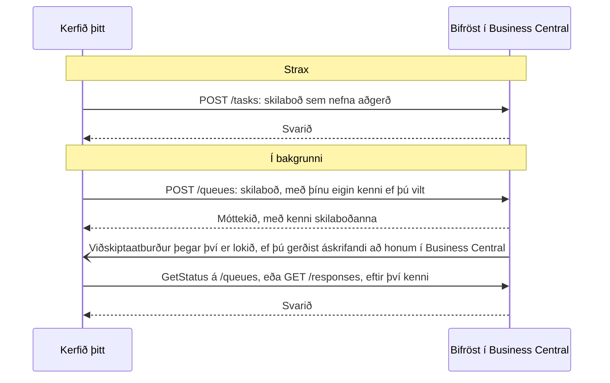

# Tenging við Bifröst: fyrir forritara

Allt sem aðstoðarmaður getur gert í gegnum Bifröst geta þín eigin kerfi gert líka, með sömu aðgerðum. Þessi síða vísar
þér á rétta tilvísun; hugmyndirnar eru í [Hvernig Bifröst virkar](/documentation/how-it-works/).

## Áður en þú byrjar {#before-you-start}

Kerfisstjóri þarf fyrst að hafa gert tvennt, í [skrefi 2 í Settu það upp](/setup/business-central/):

- **keyrt uppsetningarleiðsögnina** í hverju fyrirtæki sem þú munt kalla í;
- **bætt Entra forriti samþættingarinnar við** á síðunni **Microsoft Entra forrit** í Business Central, með
  heimildasamstæðunni `BIFROST API ori`, heimildum Business Central fyrir gögnin hennar, og bókunarhliði fyrir hverja
  höfuðbók sem hún bókar í.

Samþætting þarf hvorki [skref 3, Samþykktu einu sinni](/setup/consent/), né skrefin
[Fyrir hvern notanda](/setup/pick-your-assistant/): þau eru fyrir gervigreindaraðstoðarmenn. Hún skráir sig inn með eigin
Entra forriti.

## Tengdu annað kerfi {#connect-another-system}

Samþætting kallar í Bifröst sem **Microsoft Entra forrit** með eigin heimildum í Business Central (sjá
[Skref 2](/setup/business-central/#give-people-and-apps-permission)). Hún sendir skilaboð sem nefna aðgerðina, það er
*skilaboðategund* hennar, og les svarið, eða fær að vita þegar því er lokið.

- [INTEGRATING leiðbeiningarnar](https://github.com/businesscentralal/bc-bifrost-reference/blob/main/INTEGRATING.md)
  (á ensku): köll í Bifröst úr öðru kerfi, frá upphafi til enda

## Fáðu að vita þegar því er lokið {#get-told-when-it-is-done}

Skilaboð sem send eru á `/queues` keyra í bakgrunni. Í stað þess að spyrja aftur og aftur getur kerfið þitt gerst
áskrifandi að tveimur viðskiptaatburðum í Business Central, í flokknum **Origo Bifrost**:

| Atburður | Þegar |
|---|---|
| **Bifrost Message Completed** | Skilaboðum í biðröð er lokið |
| **Bifrost Message Failed** | Skilaboð í biðröð mistókust |

Hver tilkynning ber kenni skilaboðanna, heiti aðgerðarinnar, tengil á svarið og tímann. Lestu svarið úr `/responses` með
þeim tengli, sem sama auðkenni og sendi skilaboðin: hver sendandi sér aðeins sín eigin skilaboð. Skilaboð sem send eru á
`/tasks` vekja engan atburð, því svarið er tilbúið þegar kallinu lýkur.

Þú gerist áskrifandi eins og að hverjum öðrum viðskiptaatburði í Business Central: með vefþjónustu viðskiptaatburða, sem
sendir á slóð sem þú gefur upp, eða með Power Automate flæði. Sjá
[Business events on Business Central](https://learn.microsoft.com/en-us/dynamics365/business-central/dev-itpro/developer/business-events-overview)
(á ensku) hjá Microsoft. Auðkennið sem gerist áskrifandi þarf heimildasamstæðuna **Ext. Events – Subscr** og lesaðgang að
skilaboðum Bifröst.

## Stýrðu því frá gervigreindarfulltrúa {#drive-it-from-an-ai-agent}

Tengdu gervigreindaraðstoðarmann í gegnum Origo BC MCP-þjóninn: sjá [Tengdu aðstoðarmanninn](/setup/connect-your-ai/).
Aðstoðarmaðurinn les uppsettar aðgerðir og lýsingar þeirra úr Business Central sjálfu.

## Finndu hvað aðgerð gerir {#find-what-an-operation-does}

Aðgerðum er skipt í [lén](/documentation/how-it-works/#domains-and-operations), til dæmis Customer eða Sales. Verkfæri
MCP-þjónsins nota sama orð (`list_domains`, `describe_domains`).

Skráin er lifandi: fulltrúi eða kerfi spyr Bifröst hvaða aðgerðir eru til (`Help.MessageTypes.Get`) og les lýsingu og
samning hverrar þeirrar (`Help.Implementation.Get`). Það svar er alltaf rétt fyrir þitt umhverfi. Sami listi er á síðunni
**Bifrost Message Types** í Business Central, og MCP-verkfærin `list_message_types` og `describe_message_type` lesa hann
líka.

## Hvað það telur {#what-it-counts}

Köll samþættingar eru talin í pottinum **App Registration**, aðskilið frá köllum fólks. Hvað telst sem skilaboð:
[Notkun og mörk](/documentation/end-customers/administrators/#usage-and-limits). Sjá líka [Leyfi](/licensing/).

**Næst:** [Heimildasamstæður og hlið](/documentation/end-customers/permissions/), fyrir samstæðurnar sem samþættingin þarf.
