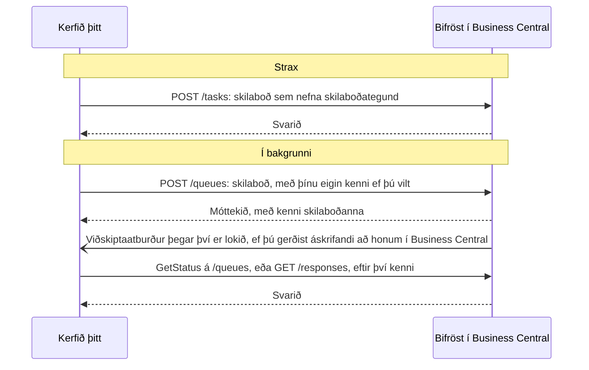

# Tenging við Bifröst: fyrir forritara

Allt sem aðstoðarmaður getur gert í gegnum Bifröst geta þín eigin kerfi gert líka, með sömu skilaboðategundum. Þessi síða
vísar þér á rétta tilvísun; hugmyndirnar eru í [Hvernig Bifröst virkar](/documentation/how-it-works/).

## Áður en þú byrjar {#before-you-start}

Kerfisstjóri þarf fyrst að hafa gert tvennt, í [skrefi 2 í Settu það upp](/setup/business-central/):

- **keyrt uppsetningarleiðsögnina** í hverju fyrirtæki sem þú munt kalla í;
- **bætt Entra forriti samþættingarinnar við** á síðunni **Microsoft Entra forrit** í Business Central, með
  heimildasamstæðunni `BIFROST API ori`, heimildum Business Central fyrir gögnin hennar, og bókunarhliði fyrir hverja
  höfuðbók sem hún bókar í.

Skref 3, tenging gervigreindaraðstoðarmanns, þarf ekki fyrir samþættingu: hún skráir sig inn með eigin Entra forriti.

## Tengdu annað kerfi {#connect-another-system}

Samþætting kallar í Bifröst sem **Microsoft Entra forrit** með eigin heimildum í Business Central (sjá
[Skref 2](/setup/business-central/#give-people-and-apps-permission)). Hún sendir skilaboð sem nefna skilaboðategund og
les svarið, eða fær að vita þegar því er lokið.

- [INTEGRATING leiðbeiningarnar](https://github.com/businesscentralal/bc-bifrost-reference/blob/main/INTEGRATING.md)
  (á ensku): köll í Bifröst úr öðru kerfi, frá upphafi til enda

## Stýrðu því frá gervigreindarfulltrúa {#drive-it-from-an-ai-agent}

Tengdu gervigreindaraðstoðarmann í gegnum Origo BC MCP-þjóninn: sjá [Tengdu aðstoðarmanninn](/setup/connect-your-ai/).
Aðstoðarmaðurinn les uppsettar skilaboðategundir og samninga þeirra úr Business Central sjálfu.

## Finndu hvað skilaboðategund gerir {#find-what-a-message-type-does}

Skilaboðategundum er skipt í [svið](/documentation/how-it-works/#capabilities-and-message-types): fyrsti hluti heitis
skilaboðategundar, til dæmis `Customer`. Í verkfærum MCP-þjónsins heitir svið *domain* (`list_domains`,
`describe_domains`).

Skráin er lifandi: fulltrúi eða kerfi spyr Bifröst hvaða skilaboðategundir eru til (`Help.MessageTypes.Get`) og les samning
hverrar þeirrar (`Help.Implementation.Get`). Það svar er alltaf rétt fyrir þitt umhverfi. Sami listi er á síðunni Bifrost
Message Types í Business Central, og MCP-verkfærin `list_message_types` og `describe_message_type` lesa hann líka.

## Hvað það telur {#what-it-counts}

Köll samþættingar eru talin í pottinum **App Registration**, aðskilið frá köllum fólks. Hvað telst sem skilaboð:
[Notkun og mörk](/documentation/end-customers/administrators/#usage-and-limits). Sjá líka [Leyfi](/licensing/).

**Næst:** [Tengdu aðstoðarmanninn](/setup/connect-your-ai/).
