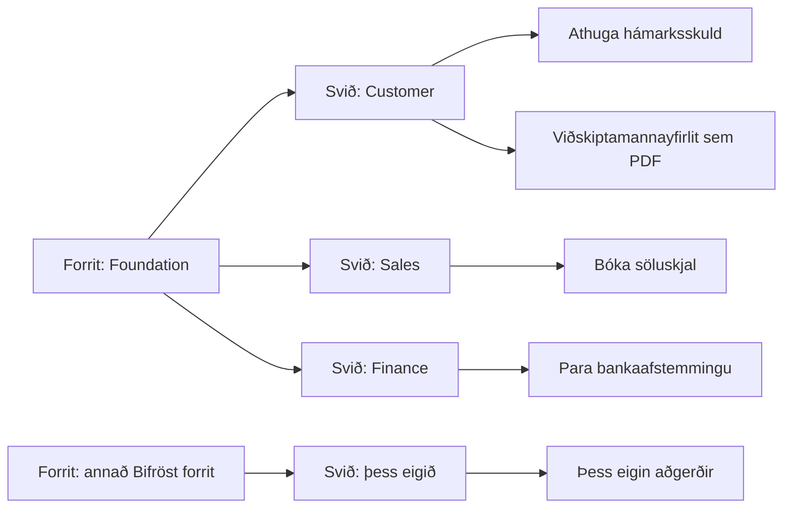

# Hvernig Bifröst virkar

**Spurðu Business Central. Það finnur út hvernig.**

Að fá nýtt svar úr bókhaldskerfi hefur alltaf þýtt að einhver þurfi fyrst að smíða það: skýrslu, samþættingu, verkefni
með fjárhagsáætlun og biðröð. Bifröst fjarlægir það skref. Þú spyrð með þínum eigin orðum, í Copilot, Claude eða öðrum
gervigreindaraðstoðarmanni, og **fulltrúi** vinnur verkið í Business Central. (Á þessari síðu þýðir *fulltrúi*
gervigreindin, eða annað kerfi, sem vinnur fyrir þig.)

Það getur gert það vegna þess að aðgerðirnar sem Bifröst býður eru birtar sem **skilaboðategundir**. Hver skilaboðategund
gerir eitt, til dæmis að athuga framboð vöru, breyta tilboði í pöntun eða bóka skjal, og hver þeirra lýsir sér sjálf:
hvað hún gerir, hvað hún þarf, hverju hún skilar og hvað getur farið úrskeiðis. Fulltrúinn les þessar lýsingar, velur
réttu aðgerðirnar og kallar á þær.

## Svið og skilaboðategundir {#capabilities-and-message-types}

Skilaboðategundum er skipt í **svið**. Fyrsti hluti heitis skilaboðategundar segir hvaða sviði hún tilheyrir. Til dæmis:

| Svið | Skilaboðategund í því |
|---|---|
| **Customer** | Athugar lánstraust viðskiptamanns: stöðu, gjaldfallna upphæð, opnar pantanir og hvað er eftir |
| **Sales** | Bókar söluskjal |
| **Item** | Reiknar út hve mikið af vöru þú getur lofað |

- **Skilaboðategund** er ein aðgerð, og það er hún sem fulltrúi kallar á. Hver þeirra lýsir sér sjálf.

- **Svið** er hópur skilaboðategunda um sama hlut, til dæmis viðskiptamenn eða söluskjöl. Fulltrúi skoðar sviðin fyrst og
  velur síðan skilaboðategund innan rétta sviðsins.
- **Forrit** er það sem þú setur upp. Það bætir við einu eða fleiri sviðum, eða fleiri skilaboðategundum í svið sem er
  til: Foundation kemur með hefðbundnu svið Business Central, og hvert annað forrit bætir við sínum.

*Í orðum: forrit bætir við sviðum, og hvert svið geymir skilaboðategundir. Foundation bætir meðal annars við Customer,
Sales og Finance; annað Bifröst forrit bætir við sínu eigin sviði. Að athuga hámarksskuld og prenta viðskiptamannayfirlit
tilheyra bæði Customer.*

Í verkfæralista aðstoðarmannsins heita sviðin *domains* (lén). Þau hafa ekkert að gera með síðuna **Copilot og eiginleikar fulltrúa** í Business Central, sem kveikir og slekkur á eiginleikum Copilot.

Vegna þess að hver skilaboðategund lýsir sér sjálf er ný tegund nothæf um leið og forrit hennar er uppsett, uppsetningu
þess lokið og heimild veitt; það þarf ekkert að kenna aðstoðarmanninum fyrst.

## Fjögur atriði sem gera það ólíkt {#four-things-that-make-it-different}

- **Ekkert er smíðað fyrir spurninguna þína.** Aðgerðirnar lýsa sér sjálfar, svo fulltrúi getur sett þær saman, líka
  fyrir spurningar sem enginn sá fyrir.
- **Það keyrir sem þú.** Hvert kall keyrir sem þinn eigin notandi í Business Central, með þínum heimildum, eða sem
  forritsauðkennið sem samþætting fékk. Það nær aðeins til þess sem auðkennið hefur leyfi til, og hvert kall er skráð í
  Business Central hjá þér. Þú ákveður hvað hvert auðkenni má; sjá
  [Kerfisstjórar](/documentation/end-customers/administrators/).
- **Það vex án nýrrar útgáfu.** Hvert Bifröst forrit sem þú setur upp bætir við sviðum, og hver tengdur fulltrúi getur
  notað þau sama dag.
- **Þú velur gervigreindina.** Copilot, ChatGPT, Claude eða hver annar aðstoðarmaður sem styður MCP virkar eins, svo þú
  ert ekki bundinn einum þjónustuaðila, og þú getur notað fleiri en einn.

## Hvernig það hangir saman {#how-it-fits-together}

import PlatformMap from '@site/src/components/PlatformMap';

<PlatformMap />

[Bifröst Foundation](/foundation/) er hliðið eina. Það geymir skrána yfir skilaboðategundir, afhendir hjálp þeirra,
athugar heimildir og leyfi, og skráir hvert kall. Allt annað í fjölskyldunni eru forrit sem bæta eigin sviðum við sömu
skrá. [Forritalistinn](/apps/) sýnir forritin sem eru í boði.

## Hvað gerist þegar þú spyrð {#what-happens-when-you-ask}

> „Hve mikið af vöru 1896-S getum við enn lofað í þessari viku, og hvar er það?"

1. **Fulltrúinn leitar** í skránni með þínum orðum og fær stuttan lista af möguleikum.
2. **Hann velur** eftir einnar línu lýsingum þeirra. Framboðsaðgerðin skilar útreiknuðu framboði eftir birgðageymslu,
   með fráteknu magni og væntanlegum móttökum, sem er það sem spurningin snýst um; birgðastaðan ein og sér svaraði henni
   ekki.
3. **Hann les hjálpina** fyrir þá skilaboðategund: hvernig á að nefna vöruna, hvað kemur til baka.
4. **Hann kallar á hana.** Foundation athugar að þú megir það, keyrir hana sem þú og skráir kallið.
5. **Hann svarar** á mæltu máli, með tölunum eftir birgðageymslu.

Breyting gengur eins fyrir sig, með einni öryggisráðstöfun til viðbótar: fulltrúinn getur skoðað áður en hann gerir.

> „Breyttu tilboði SQ-1042 í pöntun og sýndu mér hvað bókun hennar myndi gera."

Fulltrúinn breytir tilboðinu í pöntun og forskoðar síðan bókunina, sem sýnir færslurnar sem bókunin myndi stofna **án þess
að bóka nokkuð**. Þú sérð niðurstöðuna áður en nokkuð er bókað, og hvort fulltrúinn má yfirleitt bóka ræðst af heimildum
auðkennisins sem hann keyrir sem.

Þegar eitthvað fer úrskeiðis segir svarið hvað á að gera næst, til dæmis að númer sé ekki til og hvernig á að fletta því
upp. Fulltrúinn leiðréttir sig eða spyr þig.

## Hvert gögnin þín fara {#where-your-data-goes}

import DataFlow from '@site/src/components/DataFlow';

<DataFlow />

Nánar:

- **Origo** geymir hvorki efni skilaboða né viðskiptagögnin þín, og þau eru ekki notuð til að þjálfa gervigreindarlíkön.
  Leyfisþjónusta Origo geymir Bifröst stillingarnar þínar (auðkenningu fyrirtækis, heiti umhverfis og tengiupplýsingar),
  fjölda notkunar með tímum og heitum skilaboðategunda, og tætt kenni leigjandans; forritin senda henni líka tæknileg
  greiningargögn (fjarmælingar). Uppsetningarleiðsögnin sýnir hvað leyfisþjónustan geymir áður en þú samþykkir.
- **Bifröst skilaboð** í Business Central hjá þér geyma hvert kall með gögnunum sem það skilaði, eins lengi og þú
  ákveður; sjá [Annálar og varðveisla](/documentation/end-customers/administrators/#logs-and-retention).

Öll yfirlýsingin: [Persónuvernd](/licensing/privacy/).

## Hve langt það nær {#how-far-it-goes}

Frá einu svari að keðju aðgerða: [Prófaðu](/try-it-out/#what-to-ask-first) fer í gegnum þrepin, með spurningu til að
prófa fyrir hvert.

## Hvað það nær yfir, og hvernig það vex {#what-it-covers-and-how-it-grows}

Uppsetning Bifröst Foundation opnar ekki allt Business Central fyrir aðstoðarmanni. Hún opnar það sem hefur verið smíðað
fyrir það, og það er mikið:

| | Hve langt það nær | Hvernig |
|---|---|---|
| **Lesa** | Flest gögnin þín | Almennur lestur nær til hverrar töflu sem er ekki takmörkuð, innan heimilda þinna og [reitaaðgangs](/documentation/end-customers/data-access/#field-access). Flestum spurningum er hægt að svara. |
| **Gera** | Það sem hefur skilaboðategund | Stofnun, umbreyting, útgáfa og bókun þurfa hver sína skilaboðategund. Svið Foundation ná meðal annars yfir sölu, innkaup, fjármál, birgðir og verk. Ekki hvert verk í Business Central hefur slíka tegund enn. |
| **Breyta reit** | Þröng, varin leið | Almenn skrif geta breytt reitum færslu, sjálfgefið aðeins reitum sem breytingaskráin nær til ([breytingaskrárvernd](/documentation/end-customers/data-access/#the-changelog-write-guard)). Þau koma ekki í stað aðgerðar með eigin rökum Business Central. |

Þegar engin skilaboðategund er til fyrir verk getur aðstoðarmaðurinn ekki unnið það í gegnum Bifröst, og hann ætti að
segja það. Það eru mörk þess sem er uppsett, ekki villa.

### Hvert forrit færir mörkin {#every-app-moves-the-edge}

Svið koma úr forritum, og þau sameinast öll í sömu skrá, á bak við sömu heimildir og sama annál. Önnur Bifröst forrit
bæta við eigin sviðum. Hvert þeirra hefur sína eigin uppsetningarsíðu, sem er opnuð úr flokknum **Forrit** á Uppsetningu
Bifröst, sína eigin hjálp, og geymir auðkenni sín í sameiginlegu leyndarmálageymslunni; sjá [forritalistann](/apps/).

Aðstoðarmaðurinn sameinar svið úr mismunandi forritum í einu samtali.

**Vantar eitthvað?**

1. Spurðu aðstoðarmanninn: *„Hvaða svið geturðu notað hér?"* Hann telur upp það sem uppsetningin þín hefur.
2. Skoðaðu [forritalistann](/apps/): það gæti verið í forriti sem þú hefur ekki sett upp enn.
3. Ef ekki, spurðu Business Central samstarfsaðilann þinn eða [Origo](https://www.origo.is/). Það er hægt að smíða það,
   annaðhvort sem nýtt forrit eða sem fleiri skilaboðategundir í forriti sem er til.

**Næst:** [Settu það upp](/setup/), eða síðan fyrir þitt hlutverk:
[Notendur](/documentation/end-customers/users/) · [Kerfisstjórar](/documentation/end-customers/administrators/) ·
[Forritarar](/documentation/end-customers/developers/).
