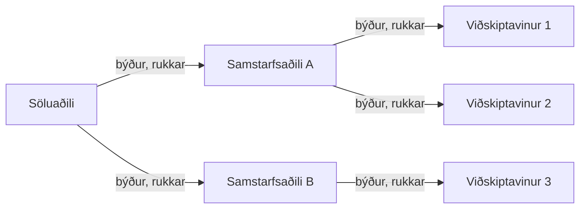
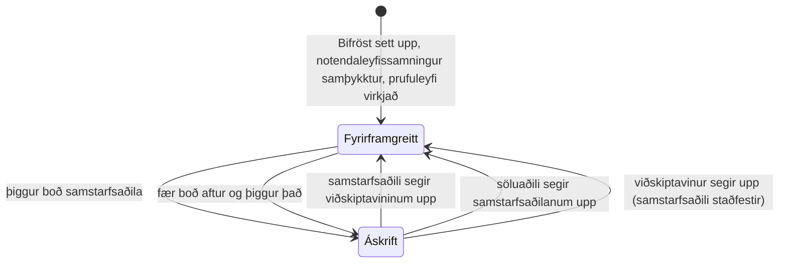

Hvert kall í Bifröst sem vinnur raunverulegt verk er talið sem ein **skilaboð**. Hvernig leigjandi
greiðir fyrir skilaboðin fer eftir **tegund leyfis** hans, og tegund leyfisins fer eftir því hvort
leigjandinn er í viðskiptum við **samstarfsaðila** Bifröst.

## Tvær tegundir leyfa

| | **Fyrirframgreitt** | **Áskrift** |
|---|---|---|
| Hver | Allir leigjendur þegar Bifröst Foundation er sett upp, og allir leigjendur sem hafa engan samstarfsaðila | Leigjandi sem hefur samþykkt boð frá samstarfsaðila Bifröst (*viðskiptavinur*) |
| Hvernig er greitt | Þú kaupir skilaboðakvóta fyrir fram og notar hann þar til hann klárast | Samstarfsaðilinn rukkar þig í hverjum mánuði fyrir skilaboðin sem þú notaðir |
| Takmörk | Keyptur kvóti, fyrir hvern [pott](./license-types.md#two-pools), og valfrjáls **mánaðarlegur kvóti** sem þú setur sjálfur | Valfrjáls **mánaðarlegur kvóti** fyrir fyrirtæki og notendur, sem þú setur sjálfur - enginn kvóti er keyptur |
| Álagsþak | Fría þrepið, 1.000 köll á dag - ekki hægt að breyta því | Fría þrepið sjálfgefið; þú getur valið hærra þrep, sem samstarfsaðilinn getur rukkað fyrir |
| Prufuleyfi | 1.000 notendaskilaboð + 1.000 forritsskráningarskilaboð, einu sinni fyrir hvern leigjanda | Óþarft - prufuleyfið var notað á meðan leigjandinn var á fyrirframgreiddu leyfi |

Ný uppsetning byrjar alltaf á **fyrirframgreiddu leyfi**: kerfisstjórinn samþykkir
notendaleyfissamninginn (EULA) og virkjar prufuleyfið í
[Uppsetningarleiðsögn Bifröst](/help/foundation/bifrost-setup-wizard/). Leigjandi verður ekki
áskriftarviðskiptavinur fyrr en síðar, þegar samstarfsaðili býður honum og hann þiggur boðið.

Sjá [Tegundir leyfa](./license-types.md) fyrir allar reglurnar, þar á meðal um sandkassa og
uppsetningar á staðnum.

## Þrjú hlutverk

| Hlutverk | Hvað það gerir | Hvar |
|---|---|---|
| **Söluaðili** | Kemur Bifröst á markað í gegnum samstarfsaðila sína. Býður samstarfsaðilum, sér viðskiptavini og notkun allra samstarfsaðila og **rukkar samstarfsaðila sína** fyrir áskriftarnotkun viðskiptavina þeirra. | [Að starfa sem söluaðili](./vendor.md) |
| **Samstarfsaðili** | Þjónar viðskiptavinum Business Central. Býður viðskiptavinum á áskriftarleyfi, sér notkun þeirra og þrep álagsþaks og **rukkar viðskiptavini sína**. | [Að starfa sem samstarfsaðili](./partner.md) |
| **Viðskiptavinur** | Leigjandi sem hefur þegið boð samstarfsaðila og er á áskriftarleyfi. Hann getur sett mánaðarlegan kvóta, valið þrep álagsþaks og sagt skilið við samstarfsaðilann. | [Að vera viðskiptavinur](./customer.md) |

Ekki er hægt að sækja um hlutverkin: Origo samþykkir söluaðila, söluaðili býður
samstarfsaðilum og samstarfsaðili býður viðskiptavinum. Söluaðili getur einnig skráð sig sem eigin
samstarfsaðila og þjónað viðskiptavinum beint.

Hvert hlutverk tilheyrir **einu fyrirtæki í hverjum Microsoft Entra leigjanda** - fyrirtækinu sem
skráði sig fyrst. Tegund leyfis gildir hins vegar fyrir **allan leigjandann**: þegar leigjandi
þiggur boð fara öll fyrirtæki hans á áskrift, líka fyrirtæki sem stofnuð eru síðar.

## Hvernig leigjandi færist á milli tegunda leyfa

Sérhver breyting sem einn leigjandi gerir fyrir annan - boð, uppsögn eða uppsagnarbeiðni - berst
hinum leigjandanum aðeins þegar leyfisstjóri þar velur **Samstilla** á síðunni Uppsetning Bifröst.
**Samstilling er það eina sem hefur skráningu** - sem söluaðili, samstarfsaðili eða viðskiptavinur -
og það eina sem virkjar uppsögn eða niðurstöðu uppsagnarbeiðni. Daglega bakgrunnsverkið tilkynnir
aðeins notkun. Sjá [Úrsögn og uppsögn](./leaving-and-cancelling.md).

## Í þessum hluta

- [Tegundir leyfa](./license-types.md) - fyrirframgreitt leyfi, áskrift, sandkassi og uppsetning á staðnum í smáatriðum
- [Álagsþak](./rate-limits.md) - þrepin og hver getur breytt þeim
- [Að starfa sem söluaðili](./vendor.md)
- [Að starfa sem samstarfsaðili](./partner.md)
- [Að vera viðskiptavinur](./customer.md)
- [Úrsögn og uppsögn](./leaving-and-cancelling.md)
- [Notkun og reikningsfærsla](./usage-and-billing.md) - skýrslur, skilaboðategundir og reikningsfærsla
- [Tilvísun um leyfisveitingar](/foundation/reference/licensing/) - samningurinn sem kallendur sjá: pottar, viðvaranir og villur
