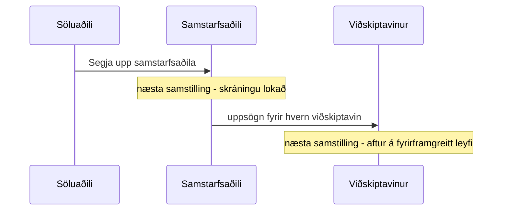

Sambandi má ljúka að ofan (söluaðili segir samstarfsaðila upp, samstarfsaðili segir viðskiptavini
upp) eða óska eftir því að neðan (viðskiptavinur eða samstarfsaðili sendir uppsagnarbeiðni). Í öllum
tilvikum fara viðkomandi viðskiptavinir aftur á **fyrirframgreitt leyfi**.

## Yfirlit

| Hvað gerist | Hver byrjar | Niðurstaða |
|---|---|---|
| **Segja upp viðskiptavini** | Samstarfsaðili, á [Umsjón viðskiptavina](/help/foundation/customer-management/) | Viðskiptavinurinn fer aftur á fyrirframgreitt leyfi. |
| **Óska eftir uppsögn hjá samstarfsaðila** | Viðskiptavinur, á Uppsetningu Bifröst | Samstarfsaðilinn staðfestir eða hafnar. Staðfest: eins og Segja upp viðskiptavini. |
| **Segja upp samstarfsaðila** | Söluaðili, á [Umsjón samstarfsaðila](/help/foundation/partner-management/) | Skráningu samstarfsaðilans er lokað; **hver viðskiptavinur þess samstarfsaðila** fer aftur á fyrirframgreitt leyfi. |
| **Óska eftir uppsögn hjá söluaðila** | Samstarfsaðili, á Uppsetningu Bifröst | Söluaðilinn staðfestir eða hafnar. Staðfest: eins og Segja upp samstarfsaðila. |
| **Afskrá sem söluaðili** | Söluaðili, á Uppsetningu Bifröst | **Öllum samstarfsaðilum** söluaðilans er sagt upp og hver viðskiptavinur þeirra fer aftur á fyrirframgreitt leyfi. |

Uppsögn getur fylgt ástæða (slegin inn í glugganum [Uppsögn - ástæða](/help/foundation/cancel-reason/)),
og hafnaðri uppsagnarbeiðni fylgir alltaf ástæða; hinn leigjandinn sér hana á Uppsetningu Bifröst.

## Hvenær breytingin tekur gildi

Hver leigjandi virkjar það sem snertir hann næst þegar leyfisstjóri velur **Samstilla** á síðunni
Uppsetning Bifröst. Daglega bakgrunnsverkið tilkynnir aðeins notkun; það virkjar aldrei uppsögn eða
niðurstöðu uppsagnarbeiðni:

Uppsögn söluaðila berst því viðskiptavinunum eftir tvær samstillingar: fyrst samstarfsaðilans og
síðan hvers viðskiptavinar.

## Hvað viðskiptavinurinn sér

Eftir samstillinguna sem virkjar uppsögnina sýnir Uppsetning Bifröst *Samstarfi þessa leigjanda við
Bifröst samstarfsaðila er lokið og uppsögnin var virkjuð við samstillingu. Leigjandinn er aftur á
fyrirframgreiddu leyfi*. Upp frá því:

- nota köll aftur keyptan skilaboðakvóta leigjandans (sjá [Tegundir leyfa](./license-types.md#prepaid));
- er álagsþakið aftur fría þrepið - þrep sem var valið á áskrift er fjarlægt;
- hverfa **Óska eftir uppsögn hjá samstarfsaðila** og **Stilla álagsþak** af Uppsetningu Bifröst.

Höfnuð uppsagnarbeiðni birtist sem *Samstarfsaðili … hafnaði uppsagnarbeiðni: ástæða*, og ekkert
breytist.

## Hvað samstarfsaðilinn og söluaðilinn halda eftir

Viðskiptavinur sem sagt hefur verið upp hverfur af Umsjón viðskiptavina, en **áskriftarnotkun hans
fram að uppsögninni** er áfram í reikningsfærslutölum þess tímabils sem uppsögnin varð á, svo
samstarfsaðilinn geti rukkað fyrir hana og söluaðilinn rukkað samstarfsaðilann. Sjá
[Notkun og reikningsfærsla](./usage-and-billing.md).

## Að koma aftur

Hægt er að bjóða fyrrverandi viðskiptavini aftur - sami samstarfsaðili eða annar - og ef boðið er
þegið fer leigjandinn aftur á áskrift. Söluaðili getur boðið fyrrverandi samstarfsaðila aftur.
