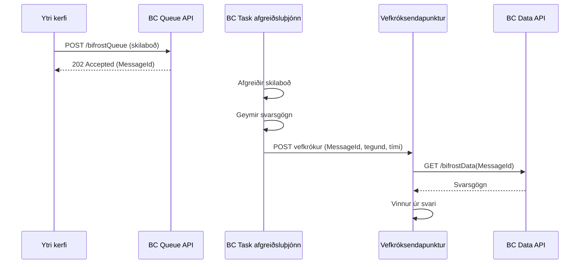

**Yfirskjal:** [API_Reference.md](/foundation/reference/api/)  
**Útfærslumappa:** `app/src/Task/`  
**Kóðaeining:** `Message Events ori` (Kóðaeining 10078250)

---

## Yfirlit

Bifröst viðbótin veitir innfædd Business Central **Ytri viðskiptaviðburðir** sem gera
ytri kerfum kleift að fá vefkrókstilkynningar þegar skilaboð í bifrost klárast eða mistakast.
Þetta leyfir viðburðadrifnar hönnunarrnar þar sem ytri kerfi fá tilkynningar strax í stað þess
að biðjast eftir stöðu.

**Helstu eiginleikar:**

- **Lágmarksupplýsingar í tilkynningum**: Vefkrókar senda aðeins nauðsynlegar upplýsingar (MessageId, MessageType, Timestamp)
- **BC-samþætting**: Notar staðlaðan Ytri viðskiptaviðburðaramma Business Central
- **Sjálfvirk endursendingarreyna**: Innbyggð endurstillingarrök fyrir misheppnaðar vefkróksafhendinnar
- **Viðburðaáskriftir**: Stilla áskriftir í gegnum Viðburðaáskriftarsíðu Business Central
- **Öruggt form**: Ytri kerfi ná í öll svarsgögn í gegnum auðkennt API-kall eftir að þau fá tilkynningar

---

## Uppbygging viðburðar

### Ytri viðskiptaviðburðir

Ytri viðskiptaviðburðir Business Central gera ytri kerfum kleift að gerast áskrifendur að viðburðum
og fá HTTP POST-tilkynningar þegar viðburðir eiga sér stað. Bifröst viðbótin birtir tvo ytri
viðskiptaviðburði:

1. **BifrostMessageCompleted**: Er gefinn út þegar skilaboð eru afgreidd með velgengi
2. **BifrostMessageFailed**: Er gefinn út þegar úrvinnsla skilaboða mistekst

### Viðburðaflokkur

Allar Bifröst vefkrókstilkynningar falla undir:
- **Heiti flokks**: "Origo Bifröst"
- **Viðburðaflokksviðbót**: Enum Extension 10077886 `Category ori`

Þennan flokk má nota til að sía og skipuleggja viðburðaáskriftir í Business Central.

### Form með lágmarksupplýsingum

Vefkrókstilkynningar senda viljandi **lágmarksupplýsingar** til að:
- **Auka öryggi**: Svarsgögn geta innihaldið viðkvæmar viðskiptaupplýsingar
- **Draga úr bandaríkjum**: Stórar svarsnargar myndu auka netgjaldsnotkun
- **Viðhalda sveigjanleika**: Áskrifendur geta sótt nákvæmar upplýsingar þegar þeir eru tilbúnir
- **Styðja endursendingu**: Minni nargar eru áreiðanlegri fyrir vefkrók endursendingarrök

Eftir að fá vefkrókstilkynningu kalla áskrifendur **Bifröst Data API** með MessageId til
að ná í öll svarsgögn.

---

## Viðburður: BifrostMessageCompleted

**Tilgangur:** Tilkynnir ytri kerfum þegar skilaboð í bifrost hafa lokið úrvinnslu með velgengi.

**Viðburðarheiti:** `BifrostMessageCompleted`  
**Birtiheiti viðburðar:** `Bifrost Message Completed`  
**Viðburðaflokkur:** `Origo Bifrost`  
**Gefinn út af:** Kóðaeining 10078251 `Message Task ori`

### Þegar viðburðurinn er gefinn út

Viðburðurinn er gefinn út **eftir** að skilaboð í bifrost hafa verið afgreidd með velgengi:

1. Skilaboð eru lögð í biðröð í gegnum Queue API eða Task API
2. Úrvinnsla skilaboðanna hefst (í gegnum bakgrunnsverkefni eða samstillt)
3. Útfærslan keyrir viðskiptalegar aðgerðir með velgengi
4. Svarsgögn eru geymd í `Message ori` töflunni
5. **Viðburðurinn er gefinn út** með MessageId, MessageType og tímastimpli lokunar
6. Vefkrókstilkynning er send til allra áskrifenda
7. Áskrifendur fá tilkynningu og geta sótt svarsgögn

### Umboð vefkróks

```json
{
  "MessageId": "a8f5f167-8f2c-4a42-9b3e-5c6c7d8e9f0a",
  "MessageType": "Customer.CreditLimit.Get",
  "ResponseContentLink": "/api/origo/bifrost/v1.0/responses(a8f5f167-8f2c-4a42-9b3e-5c6c7d8e9f0a)/data",
  "Timestamp": "2026-03-08T14:30:22Z"
}
```

### Reitir í umboðinu

| Reitur | Tegund | Lýsing |
|---|---|---|
| `MessageId` | Guid | Einkvæmt auðkenni skilaboðanna. Notaðu þetta til að kalla GET /bifrostData(MessageId) til að ná í öll svarsgögn. |
| `MessageType` | Text[250] | Tegund skilaboðanna sem klárast (t.d. "Customer.CreditLimit.Get", "Data.Records.Get"). Hægt að nota til leiðarins eða síunar. |
| `ResponseContentLink` | Text[250] | Bein API-tengill til að sækja svarsgögn. Notaðu þessa slóð til að ná í öll svar án þess að smíða API-slóðina handvirkt. |
| `Timestamp` | DateTime | Þegar skilaboðin klárðust (ISO 8601 snið). |

### Að ná í öll svarsgögn

Eftir að fá vefkrókstilkynningu, kalaðu Bifröst Data API til að ná í öll svarsgögn:

**Beiðni:**
```http
GET /api/origo/bifrost/v1.0/responses('{message-id}')
Authorization: Bearer {token}
```

**Svar:**
```json
{
  "id": "a8f5f167-8f2c-4a42-9b3e-5c6c7d8e9f0a",
  "data": "... öll svarsgögn sem base64 eða JSON ..."
}
```

### Dæmi um samþættingarflæði



### Notkunartilvik

- **Ósamstillt úrvinnsla**: Ytri kerfi fær tafarlausar tilkynningar þegar langvarandi aðgerðir klárast
- **Viðburðadrifin hönnun**: Sett af stað verkflæði í ytri kerfum byggt á lokun BC skilaboða
- **Rauntímasamþætting**: Lágmarka tafir milli BC-úrvinnslu og viðbragðs ytri kerfis
- **Ótengd kerfi**: Ytri kerfi þurfa ekki að biðjast eftir stöðu frá BC

---

## Viðburður: BifrostMessageFailed

**Tilgangur:** Tilkynnir ytri kerfum þegar úrvinnsla skilaboða í bifrost hefur mistekist.

**Viðburðarheiti:** `BifrostMessageFailed`  
**Birtiheiti viðburðar:** `Bifrost Message Failed`  
**Viðburðaflokkur:** `Origo Bifrost`  
**Gefinn út af:** Kóðaeining 10078249 `Message Error ori`

### Þegar viðburðurinn er gefinn út

Viðburðurinn er gefinn út **eftir** að úrvinnsla skilaboða í bifrost hefur mistekist:

1. Skilaboð eru lögð í biðröð í gegnum Queue API eða Task API
2. Úrvinnsla skilaboðanna hefst (í gegnum bakgrunnsverkefni eða samstillt)
3. Útfærslan lendir í villu eða sannvottun mistekst
4. Villuupplýsingar eru fangaðar og geymdar í `Message ori` töflunni
5. **Viðburðurinn er gefinn út** með MessageId, MessageType og tímastimpli mistaks
6. Vefkrókstilkynning er send til allra áskrifenda
7. Áskrifendur fá tilkynningu og geta sótt villuupplýsingar

### Umboð vefkróks

```json
{
  "MessageId": "b9f6f267-9f3d-5b52-0c4f-6d7d8e9f1b1b",
  "MessageType": "Data.Records.Set",
  "ResponseContentLink": "/api/origo/bifrost/v1.0/responses(b9f6f267-9f3d-5b52-0c4f-6d7d8e9f1b1b)/data",
  "Timestamp": "2026-03-08T14:35:18Z"
}
```

### Reitir í umboðinu

| Reitur | Tegund | Lýsing |
|---|---|---|
| `MessageId` | Guid | Einkvæmt auðkenni skilaboðanna. Notaðu þetta til að kalla GET /bifrostQueue(MessageId) til að ná í villuupplýsingar. |
| `MessageType` | Text[250] | Tegund skilaboðanna sem mistókst (t.d. "Data.Records.Set", "Sales.Document.Release"). |
| `ResponseContentLink` | Text[250] | Bein API-tengill til að sækja villuupplýsingar. Notaðu þessa slóð til að ná í villusvari án þess að smíða API-slóðina handvirkt. |
| `Timestamp` | DateTime | Þegar úrvinnsla skilaboðanna mistókst (ISO 8601 snið). |

### Að ná í villuupplýsingar

Eftir að fá vefkrókstilkynningu, kalaðu Queue API ori til að ná í villuupplýsingar:

**Beiðni:**
```http
GET /api/origo/bifrost/v1.0/queues('{message-id}')
Authorization: Bearer {token}
```

**Svar:**
```json
{
  "id": "b9f6f267-9f3d-5b52-0c4f-6d7d8e9f1b1b",
  "type": "Data.Records.Set",
  "specversion": "1.0",
  "source": "MyIntegrationApp v1.0",
  "time": "2026-03-08T14:35:15Z",
  "datacontenttype": "text/json",
  "data": "{
    \"error\": \"Record not found\",
    \"detailedMessage\": \"Table: Customer, SystemId: {guid}\",
    \"stackTrace\": \"...\",
    \"callStack\": \"...\"
  }"
}
```

### Snið villusvars

Villusvar er geymt á JSON-sniði með eftirfarandi reitum:

- **error**: Stutt villutilkynning
- **detailedMessage**: Nákvæm villuframsetning
- **stackTrace**: Öll stafla (ef til staðar)
- **callStack**: Kallstafla á villutíma (ef til staðar)

### Notkunartilvik

- **Villufylgjast með**: Ytri kerfi geta skráð og sent viðvörun um bilanir strax
- **Sjálfvirk endursendingarreyna**: Ytri kerfi geta útfært endurhleðslu-rök með veldisreiknum bið
- **Villugreining**: Ná í nákvæmar villuupplýsingar til úrræðaleitunar
- **SLA-eftirlit**: Fylgjast með úrvinnslubilonum og svartíma

---

## Samþættingarviðburðir

Auk Ytri viðskiptaviðburða fyrir vefkróka veitir Bifröst viðbótin **Samþættingarviðburði**
sem leyfa öðrum Business Central viðbótum að bregðast við skilaboðalíftímaviðburðum.

### OnBeforeBifrostMessageProcessing

**Tilgangur:** Gefinn út áður en úrvinnsla skilaboða í bifrost hefst.

**Viðburðartegund:** IntegrationEvent  
**Aðgengi:** Internal  
**Gefinn út af:** Kóðaeining 10078251 `Message Task ori`

**Undirskrift:**
```al
[IntegrationEvent(false, false)]
internal procedure OnBeforeBifrostMessageProcessing(var BifrostMessage: Record "Message ori")
```

**Færibreytur:**
- `BifrostMessage`: Skilaboðafærslan sem er að fara í vinnslu (sent með tilvísun, hægt að breyta)

**Notkunartilvik:**
- **Sannprófun fyrir úrvinnslu**: Sannreyna gögn skilaboða áður en úrvinnsla hefst
- **Gagnabæting**: Bæta við viðbótarsamhengi eða lýsigögnum við skilaboðin
- **Telemetría**: Skrá upphaf úrvinnslu skilaboða
- **Sérsniðin leiðsögn**: Breyta tegund eða gögnum skilaboða byggt á sérsniðnum rökum

### OnAfterBifrostMessageCompleted

**Tilgangur:** Gefinn út eftir að skilaboð í bifrost hefur lokið með velgengi.

**Viðburðartegund:** IntegrationEvent  
**Aðgengi:** Internal  
**Gefinn út af:** Kóðaeining 10078251 `Message Task ori`

**Undirskrift:**
```al
[IntegrationEvent(false, false)]
internal procedure OnAfterBifrostMessageCompleted(var BifrostMessage: Record "Message ori")
```

**Færibreytur:**
- `BifrostMessage`: Skráin fyrir klárað skilaboðið (sent með tilvísun)

**Notkunartilvik:**
- **Vinnsla eftirá**: Framkvæma viðbótaraðgerðir eftir velgengna úrvinnslu
- **Gagnassamstilling**: Samstilla gögn skilaboða við aðrar töflur eða kerfi
- **Telemetría**: Skrá lokunarmælingar (tímalengd, stærð o.s.frv.)
- **Verkflæðishlekkjun**: Hefja háð verkflæði eða ferla

### OnAfterBifrostMessageFailed

**Tilgangur:** Gefinn út eftir að úrvinnsla skilaboða í bifrost hefur mistekist.

**Viðburðartegund:** IntegrationEvent  
**Aðgengi:** Internal  
**Gefinn út af:** Kóðaeining 10078249 `Message Error ori`

**Undirskrift:**
```al
[IntegrationEvent(false, false)]
internal procedure OnAfterBifrostMessageFailed(var BifrostMessage: Record "Message ori"; ErrorText: Text)
```

**Færibreytur:**
- `BifrostMessage`: Skráin fyrir misheppnaðan skilaboðið (sent með tilvísun)
- `ErrorText`: Texti villuskilaboðanna

**Notkunartilvik:**
- **Villuskráning**: Skrá villur í sérsniðnar skráningartöflur
- **Viðvörunargerð**: Senda viðvaranir í gegnum tölvupóst eða aðrar leiðir
- **Sjálfvirk bata**: Reyna sjálfvirka endurheimtu eða lagfæringu gagna
- **Greiningar**: Fylgjast með villumynstrum og bilunartíðni

---

## Uppsetning vefkróksáskrifta

### Forskilyrði

1. **Ytri vefkróksendapunktur**: Þú þarft HTTPS-endapunkt sem getur tekið við POST-beiðnum
2. **Kröfur til endapunkts**:
   - Verður að styðja HTTPS (ekki HTTP)
   - Verður að svara með 2xx stöðukóða innan tímamarka (sjálfgefið 30 sekúndur)
   - Ætti að meðhöndla tvíteknar tilkynningar (einkvæmni)
   - Ætti að útfæra veldisvísisvöxt bið fyrir endursendingar

### Stillingarskref

#### Skref 1: Farðu á Viðburðaáskriftir

1. Opnaðu BC vafraviðmót
2. Leitaðu að **"Event Subscriptions"**
3. Opnaðu Viðburðaáskriftarsíðuna

#### Skref 2: Búðu til nýja áskrift

1. Smelltu á **Nýtt**
2. Fylltu inn eftirfarandi reiti:

| Reitur | Gildi | Lýsing |
|---|---|---|
| **Subscriber ID** | (Sjálfkrafa) | Einkvæmt auðkenni áskriftarinnar |
| **Event Name** | `BifrostMessageCompleted` eða `BifrostMessageFailed` | Veldu hvaða viðburð á að gerast áskrifandi að |
| **Company Name** | Heiti fyrirtækisins þíns | Fyrirtækjasamhengi viðburðarins |
| **Event Category** | `Origo Bifrost` | Sía í Bifröst flokk |
| **Endpoint URL** | `https://your-domain.com/webhook/bc-bifrost` | Slóð vefkróksendapunktsins þíns |
| **Authentication** | (Veldu aðferð) | Hvernig á að auðkenna við endapunktinn þinn |

#### Skref 3: Stilla auðkenningu

Veldu auðkenningaraðferð:

**Valkostur 1: OAuth 2.0 (Mælt með)**
- **Grant Type**: Client Credentials
- **Authorization URL**: OAuth-veituslóð þín
- **Client ID**: OAuth-biðlaraauðkenni þitt
- **Client Secret**: OAuth-biðlaraleynd þín
- **Token URL**: OAuth-táknaendapunktur þinn

**Valkostur 2: Grunnauðkenning**
- **Username**: Grunnauðkenningarnotendanafn þitt
- **Password**: Grunnauðkenningarlykillinn þinn

**Valkostur 3: API-lykill**
- **API Key Name**: Hausnafn (t.d. "X-API-Key")
- **API Key Value**: API-lykillinn þinn

**Valkostur 4: Ekkert**
- Engin auðkenning (ekki mælt með í framleiðslu)

#### Skref 4: Prófaðu áskriften

1. Notaðu **"Test Subscription"** aðgerðina til að senda prófunarviðburð
2. Staðfestu að endapunkturinn þinn fær prófunarumboðið
3. Athugaðu **"Last Delivery Status"** reitinn fyrir velgengi/bilun

#### Skref 5: Virkjaðu áskriften

1. Stilltu **"Enabled"** reitinn á **Já**
2. Áskriftin er nú virk og mun fá viðburði

### Bestu venjur vefkróksendapunkts

#### 1. Einkvæmni {#einkvmni}

Endapunkturinn þinn ætti að meðhöndla tvíteknar tilkynningar af þolinmæði:

```javascript
// Dæmi: Node.js Express endapunktur
app.post('/webhook/bc-bifrost', async (req, res) => {
  const { MessageId, MessageType, ResponseContentLink, Timestamp } = req.body;
  
  // Athugaðu hvort við höfum þegar meðhöndlað þessi skilaboð
  const exists = await db.checkMessageProcessed(MessageId);
  if (exists) {
    console.log(`Tvítekin tilkynning fyrir ${MessageId}, hunsa`);
    return res.status(200).send('OK'); // Skiltu samt 200 til að koma í veg fyrir endursendingu
  }
  
  // Merktu sem í vinnslu áður en gögnum er sótt
  await db.markMessageProcessing(MessageId);
  
  // Sæktu öll svarsgögn frá BC með gefnum tengli
  const response = await fetchBifrostData(ResponseContentLink);
  
  // Vinndu úr svarinu
  await processResponse(response, MessageType);
  
  // Merktu sem kláraðan
  await db.markMessageCompleted(MessageId);
  
  res.status(200).send('OK');
});
```

#### 2. Ósamstillt úrvinnsla {#samstillt-rvinnsla}

Svaraðu vefkróknum fljótt og vinndu gögn ósamstillt:

```javascript
app.post('/webhook/bc-bifrost', async (req, res) => {
  const { MessageId, MessageType, ResponseContentLink, Timestamp } = req.body;
  
  // Settu strax í biðröð fyrir bakgrunnsvinnslu
  await queue.enqueue({
    messageId: MessageId,
    messageType: MessageType,
    responseContentLink: ResponseContentLink,
    timestamp: Timestamp
  });
  
  // Svaraðu strax
  res.status(200).send('OK');
});

// Bakgrunnsverkmaður vinnur biðröðina
backgroundWorker.on('job', async (job) => {
  const response = await fetchBifrostData(job.responseContentLink);
  await processResponse(response, job.messageType);
});
```

#### 3. Villumeðhöndlun {#villumehndlun}

Útfærðu viðeigandi villumeðhöndlun og skráningu:

```javascript
app.post('/webhook/bc-bifrost', async (req, res) => {
  try {
    const { MessageId, MessageType, ResponseContentLink, Timestamp } = req.body;
    
    // Staðfesttu umboð
    if (!MessageId || !MessageType || !ResponseContentLink || !Timestamp) {
      console.error('Ógilt umboð móttekið', req.body);
      return res.status(400).send('Invalid payload');
    }
    
    // Settu í biðröð fyrir vinnslu
    await queue.enqueue({
      messageId: MessageId,
      messageType: MessageType,
      responseContentLink: ResponseContentLink,
      timestamp: Timestamp
    });
    
    res.status(200).send('OK');
  } catch (error) {
    console.error('Villa við vefkróksvinnuslu:', error);
    // Skilaðu 4xx fyrir biðlaravillur (ekki endurreyna)
    // Skilaðu 5xx fyrir þjónaravillur (BC mun endurreyna)
    res.status(500).send('Internal Server Error');
  }
});
```

#### 4. Meðhöndlun endursendinga {#mehndlun-endursendinga}

Meðhöndlaðu endursendingar með veldisreiknum bið þegar gögn eru sótt frá BC:

```javascript
async function fetchBifrostData(messageId, maxRetries = 3) {
  for (let attempt = 1; attempt <= maxRetries; attempt++) {
    try {
      const response = await bcApi.get(`/bifrostData(${messageId})`);
      return response.data;
    } catch (error) {
      if (attempt === maxRetries) throw error;
      
      // Veldisreikinn bið: 1s, 2s, 4s
      const delay = Math.pow(2, attempt - 1) * 1000;
      await sleep(delay);
    }
  }
}
```

#### 5. Eftirlit og viðvaranir {#eftirlit-og-vivaranir}

Útfærðu eftirlit fyrir bilanir í afhendingu vefkróka:

```javascript
app.post('/webhook/bc-bifrost', async (req, res) => {
  const startTime = Date.now();
  
  try {
    const { MessageId, MessageType, Timestamp } = req.body;
    
    await queue.enqueue({
      messageId: MessageId,
      messageType: MessageType,
      timestamp: Timestamp
    });
    
    // Fylgstu með velgengismælingar
    metrics.webhookReceived(MessageType);
    metrics.webhookLatency(Date.now() - startTime);
    
    res.status(200).send('OK');
  } catch (error) {
    // Fylgstu með bilanarmælingar
    metrics.webhookFailed(error);
    
    // Sendu viðvörun um alvarleg mistök
    if (shouldAlert(error)) {
      alerting.sendAlert('Villa við vinnuslu vefkróks', error);
    }
    
    res.status(500).send('Internal Server Error');
  }
});
```

---

## Prófun vefkróka

### Prófunarskil á skilaboðum

Leggðu fram prófunarskilaboð til að kveikja á vefkrókstilkynningum:

```bash
# Leggðu fram prófunarskilaboð í Queue API
curl -X POST "https://your-bc-instance/api/origo/bifrost/v1.0/queues" \
  -H "Authorization: Bearer YOUR_TOKEN" \
  -H "Content-Type: application/json" \
  -d '{
    "specversion": "1.0",
    "type": "Help.Tables.Get",
    "source": "Webhook Test v1.0"
  }'
```

### Fylgjast með afhendingu viðburðar

1. Opnaðu **Viðburðaáskriftir** síðuna í Business Central
2. Finndu áskriftina þína
3. Athugaðu eftirfarandi reiti:
   - **Last Delivery Status**: Velgengni/Mistök
   - **Last Delivery Attempt**: Tímastimpill síðustu afhendingartilraunar
   - **Last Delivery Error**: Villuskilaboð ef afhending mistókst

### Úrræðaleit

#### Vefkrókur tekur ekki við viðburðum

1. **Athugaðu stöðu áskriftar**: Gakktu úr skugga um að áskriftin sé **Virkjuð**
2. **Staðfestu heiti viðburðar**: Gakktu úr skugga um að þú sért áskrifandi að réttu viðburðinum (`BifrostMessageCompleted` eða `BifrostMessageFailed`)
3. **Athugaðu endapunktsslóð**: Staðfestu að slóðin sé rétt og aðgengileg
4. **Prófaðu tengingu**: Notaðu "Test Subscription" aðgerðina í Viðburðaáskriftum
5. **Farðu yfir eldveggslegar reglur**: Gakktu úr skugga um að BC geti náð endapunktinum þínum
6. **Athugaðu auðkenningu**: Staðfestu að skilríki séu rétt

#### Afhendingarbilanir

1. **Athugaðu svartíma endapunkts**: Verður að svara innan tímamarka (sjálfgefið 30s)
2. **Staðfestu HTTPS**: Endapunktur verður að nota HTTPS, ekki HTTP
3. **Athugaðu stöðukóða**: Endapunktur verður að skila 2xx stöðukóða
4. **Farðu yfir villukladda**: Athugaðu "Last Delivery Error" reitinn í Viðburðaáskriftum
5. **Prófaðu handvirkt**: Kalaðu endapunktinn þinn beint með dæmilegum umboðum

#### Tvíteknar tilkynningar

Business Central gæti sent tvíteknar tilkynningar í tilteknum aðstæðum:
- Nettímamörk (BC fékk ekki svar í tæka tíð)
- Endursendingarbilanir (endapunktur skilaði 5xx villu)
- Kerfisendurræsing við afhendingu

**Lausn**: Útfærðu einkvæmni í vefkróksendapunktinum þínum (sjá Bestu venjur hér að ofan)
