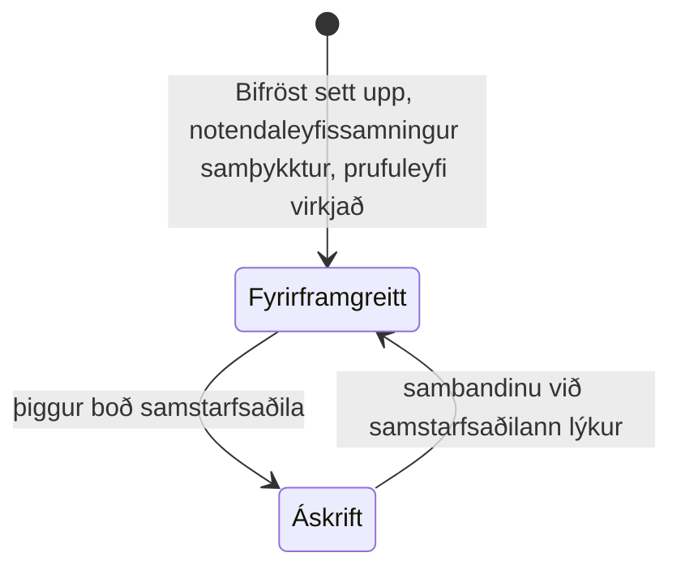

Hvert kall í Bifröst sem vinnur raunverulegt verk er talið sem ein **skilaboð**. Hvernig leigjandi
greiðir fyrir skilaboðin fer eftir **tegund leyfis** hans, og tegund leyfisins fer eftir því hvort
leigjandinn er í viðskiptum við **samstarfsaðila** Bifröst.

## Tvær tegundir leyfa

| | **Fyrirframgreitt** | **Áskrift** |
|---|---|---|
| Hver | Allir leigjendur þegar Bifröst Foundation er sett upp, og allir leigjendur sem hafa engan samstarfsaðila | Leigjandi sem hefur samþykkt boð frá samstarfsaðila Bifröst (*viðskiptavinur*) |
| Hvernig er greitt | Þú kaupir skilaboðakvóta fyrir fram og notar hann þar til hann klárast | Samstarfsaðilinn rukkar þig í hverjum mánuði fyrir skilaboðin sem þú notaðir |
| Takmörk | Keyptur kvóti, fyrir hvern [pott](./license-types.md#two-pools), og valfrjáls **mánaðarlegur kvóti** sem þú setur sjálfur | Valfrjáls **mánaðarlegur kvóti** fyrir fyrirtæki og notendur, sem þú setur sjálfur - enginn kvóti er keyptur |
| Álagsþak | Fría þrepið, 1.000 köll á dag - ekki hægt að breyta því | Fría þrepið sjálfgefið; þú getur valið hærra þrep, sem samstarfsaðilinn getur rukkað fyrir |
| Prufuleyfi | 1.000 notendaskilaboð + 1.000 forritsskráningarskilaboð, einu sinni fyrir hvern leigjanda | Óþarft - prufuleyfið var notað á meðan leigjandinn var á fyrirframgreiddu leyfi |

Ný uppsetning byrjar alltaf á **fyrirframgreiddu leyfi**: kerfisstjórinn samþykkir
notendaleyfissamninginn (EULA) og virkjar prufuleyfið í
[Uppsetningarleiðsögn Bifröst](/help/foundation/bifrost-setup-wizard/). Leigjandi verður ekki
áskriftarviðskiptavinur fyrr en síðar, þegar samstarfsaðili býður honum og hann þiggur boðið.

Sjá [Tegundir leyfa](./license-types.md) fyrir allar reglurnar, þar á meðal um sandkassa og
uppsetningar á staðnum.

## Hvernig leigjandi færist á milli tegunda leyfa {#how-a-tenant-moves-between-license-types}

Leigjandi fer á **áskriftarleyfi** þegar hann þiggur boð frá samstarfsaðila Bifröst og fer aftur á
**fyrirframgreitt leyfi** þegar því sambandi lýkur. Tegund leyfis gildir fyrir **allan
leigjandann**: þegar leigjandi þiggur boð fara öll fyrirtæki hans á áskrift, líka fyrirtæki sem
stofnuð eru síðar.

Breyting á sambandi leigjandans við samstarfsaðila tekur gildi þegar leyfisstjóri velur
**Samstilla** á síðunni Uppsetning Bifröst.

## Í þessum hluta

- [Tegundir leyfa](./license-types.md) - fyrirframgreitt leyfi, áskrift, sandkassi og uppsetning á staðnum í smáatriðum
- [Álagsþak](./rate-limits.md) - þrepin og hvernig þrep er valið
- [Notkunarskilmálar](./eula.md) og [Persónuvernd](./privacy.md)
- [Notkun og reikningsfærsla](./usage-and-billing.md) - hvernig notkun þín er tilkynnt og hvar þú sérð hana
- [Tilvísun um leyfisveitingar](/foundation/reference/licensing/) - samningurinn sem kallendur sjá: pottar, viðvaranir og villur
